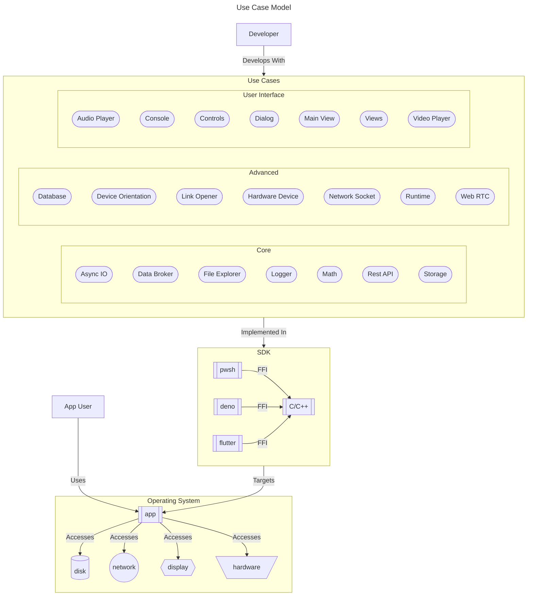

<!--
TITLE: CodeMelted - DEV | Module Design
PUBLISH_DATE: 2024-03-23
AUTHOR: Mark Shaffer
KEYWORDS:
DESCRIPTION: Software engineers are now required to learn multiple languages, technologies, and frameworks in order to fully support full stack engineering. This project aims to simplify by developing a set of cross platform modules implementing a similar / identical Application Program Interface (API) regardless of the chosen technology covered by this project.  This allows a developer to maximize their productivity because regardless of the technology, they are learning a similar module API for their solution.
-->

    

<h1> CodeMelted - Module Design</h1>

"Write once, run anywhere (WORA)" was the famous slogan made by Sun Microsystems in 1995.  At the time, this technology allowed for easy full stack engineering allowing you to target dedicated workstations and on premise servers. So long as a Java Runtime Environment existed, you could run your code. Java was unable to keep to their slogan as web browsers became more advanced, mobile devices became ubiquitous, and companies no longer required dedicated servers.

Software engineers are now required to learn multiple languages, technologies, and frameworks in order to fully support full stack engineering. This project aims to simplify by developing a set of cross platform modules implementing a similar / identical Application Program Interface (API) regardless of the chosen technology covered by this project.  This allows a developer to maximize their productivity because regardless of the technology, they are learning a similar module API for their solution.

**Table of Contents**

- [FEATURES](#features)
  - [Core Use Cases](#core-use-cases)
  - [Advanced Use Cases](#advanced-use-cases)
  - [User Interface Use Cases](#user-interface-use-cases)
- [GETTING STARTED](#getting-started)
- [USAGE](#usage)
- [LICENSE](#license)

## FEATURES

### Core Use Cases

<mark>TBD</mark>

- [Async IO](use_cases/core/async_io.md)
- [Data Broker](use_cases/core/data_broker.md)
- [File Explorer](use_cases/core/file_explorer.md)
- [Logger](use_cases/core/logger.md)
- [Math](use_cases/core/math.md)
- [Rest API](use_cases/core/rest_api.md)
- [Storage](use_cases/core/storage.md)

### Advanced Use Cases

<mark>TBD</mark>

- [Database](use_cases/advanced/database.md)
- [Device Orientation](use_cases/advanced/device_orientation.md)
- [Hardware Device](use_cases/advanced/hardware_device.md)
- [Link Opener](use_cases/advanced/link_opener.md)
- [Network Socket](use_cases/advanced/network_socket.md)
- [Runtime](use_cases/advanced/runtime.md)
- [Web RTC](use_cases/advanced/web_rtc.md)

### User Interface Use Cases

<mark>TBD</mark>

- [Audio Player](use_cases/ui/audio_player.md)
- [Console](use_cases/ui/console.md)
- [Controls](use_cases/ui/controls.md)
- [Dialog](use_cases/ui/dialog.md)
- [Main View](use_cases/ui/main_view.md)
- [Views](use_cases/ui/views.md)
- [Video Player](use_cases/ui/video_player.md)

## GETTING STARTED

<mark>TBD</mark>

## USAGE

<mark>TBD</mark>

## LICENSE

MIT License

© 2024 Mark Shaffer

Permission is hereby granted, free of charge, to any person obtaining a copy
of this software and associated documentation files (the "Software"), to deal
in the Software without restriction, including without limitation the rights
to use, copy, modify, merge, publish, distribute, sublicense, and/or sell
copies of the Software, and to permit persons to whom the Software is
furnished to do so, subject to the following conditions:

The above copyright notice and this permission notice shall be included in all
copies or substantial portions of the Software.

THE SOFTWARE IS PROVIDED "AS IS", WITHOUT WARRANTY OF ANY KIND, EXPRESS OR
IMPLIED, INCLUDING BUT NOT LIMITED TO THE WARRANTIES OF MERCHANTABILITY,
FITNESS FOR A PARTICULAR PURPOSE AND NONINFRINGEMENT. IN NO EVENT SHALL THE
AUTHORS OR COPYRIGHT HOLDERS BE LIABLE FOR ANY CLAIM, DAMAGES OR OTHER
LIABILITY, WHETHER IN AN ACTION OF CONTRACT, TORT OR OTHERWISE, ARISING FROM,
OUT OF OR IN CONNECTION WITH THE SOFTWARE OR THE USE OR OTHER DEALINGS IN THE
SOFTWARE.