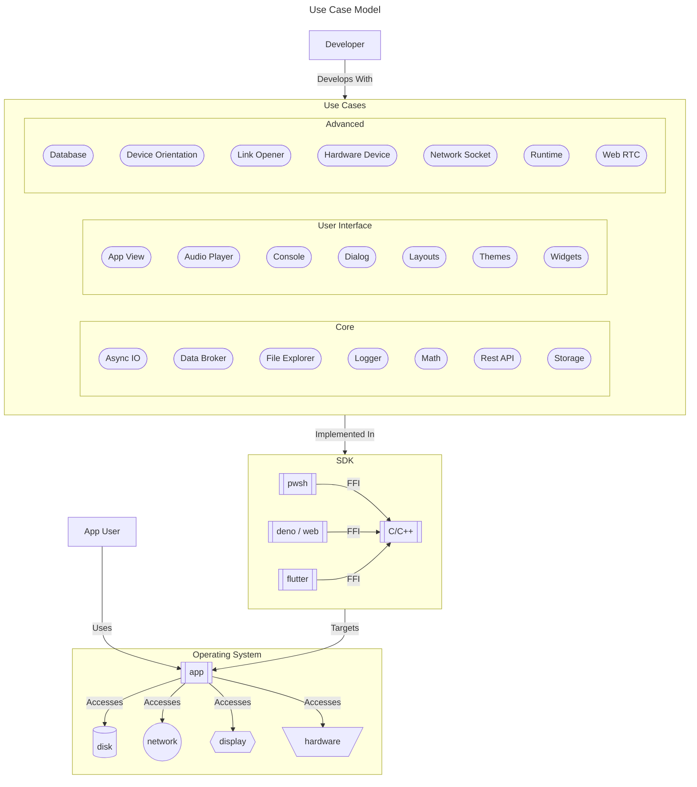

<!--
TITLE: CodeMelted - Developer
PUBLISH_DATE: 2024-04-12
AUTHOR: Mark Shaffer
KEYWORDS: raspberry-pi, modules, cross-platform, gps, cpp-library, html-css-javascript, c-library, flutter-apps, pwsh, js-module, flutter-library, deno-module, pwsh-scripts, pwsh-module
DESCRIPTION: Software engineers are now required to learn multiple languages, technologies, and frameworks in order to fully support full stack engineering. This project aims to simplify by developing a set of cross platform modules implementing a similar / identical Application Program Interface (API) regardless of the chosen technology covered by this project. This allows a developer to maximize their productivity because regardless of the technology, they are learning a similar module API for their solution.
-->

    

<h1> CodeMelted - Developer</h1>

"Write once, run anywhere (WORA)" was the famous slogan made by Sun Microsystems in 1995.  At the time, this technology allowed for easy full stack engineering allowing you to target dedicated workstations and on premise servers. So long as a Java Runtime Environment existed, you could run your code. Java was unable to keep to their slogan as web browsers became more advanced, mobile devices became ubiquitous, and companies no longer required dedicated servers.

Software engineers are now required to learn multiple languages, technologies, and frameworks in order to fully support full stack engineering. This project aims to simplify by developing a set of cross platform modules implementing a similar / identical Application Program Interface (API) regardless of the chosen technology covered by this project. This allows a developer to maximize their productivity because regardless of the technology, they are learning a similar module API for their solution.

**Table of Contents**

- [FEATURES](#features)
  - [Core](#core)
  - [User Interface](#user-interface)
  - [Advanced](#advanced)
- [GETTING STARTED](#getting-started)
  - [Environment Setup](#environment-setup)
    - [GitHub](#github)
    - [Programming Languages](#programming-languages)
    - [VS Code](#vs-code)
  - [Versioning](#versioning)
  - [Build Script](#build-script)
- [USAGE](#usage)
  - [Cross Platform Modules](#cross-platform-modules)
  - [GitHub Gists](#github-gists)
  - [Raspberry Pi Project](#raspberry-pi-project)
  - [SDK Docs](#sdk-docs)
- [LICENSE](#license)

## FEATURES

### Core

The core set of use cases represent the most common actions you will carry out when developing an application.

- [Async IO](use_cases/core/async_io.md)
- [Data Broker](use_cases/core/data_broker.md)
- [File Explorer](use_cases/core/file_explorer.md)
- [Logger](use_cases/core/logger.md)
- [Math](use_cases/core/math.md)
- [Rest API](use_cases/core/rest_api.md)
- [Storage](use_cases/core/storage.md)

### User Interface

The user interface set of use cases solidifies the ability to have a standard set of actions to interact with your user without limiting you from utilizing the options available in a given SDK module.

- [App View](use_cases/ui/app_view.md)
- [Audio Player](use_cases/ui/audio_player.md)
- [Console](use_cases/ui/console.md)
- [Dialog](use_cases/ui/dialog.md)
- [Layouts](use_cases/ui/layouts.md)
- [Themes](use_cases/ui/themes.md)
- [Widgets](use_cases/ui/widgets.md)

### Advanced

The advanced set of use cases offer more complex actions a developer may need to carry out in their application. This aims to simplify the complexity of the given actions.

- [Database](use_cases/advanced/database.md)
- [Device Orientation](use_cases/advanced/device_orientation.md)
- [Hardware Device](use_cases/advanced/hardware_device.md)
- [Link Opener](use_cases/advanced/link_opener.md)
- [Network Socket](use_cases/advanced/network_socket.md)
- [Runtime](use_cases/advanced/runtime.md)
- [Web RTC](use_cases/advanced/web_rtc.md)

## GETTING STARTED

The following sections capture how to setup and utilize this repo with your local clone.

### Environment Setup

The following are the items recommended for installation to properly make use of this repo in your development environment.

#### GitHub

- [ ] [git](https://git-scm.com/downloads)
- [ ] [GitHub Desktop](https://desktop.github.com/)

#### Programming Languages

- [ ] [C/C++](https://code.visualstudio.com/docs/languages/cpp)
- [ ] [Deno](https://deno.com/)
- [ ] [Flutter](https://flutter.dev/)
- [ ] [PowerShell Core](https://github.com/PowerShell/PowerShell)

#### VS Code

**The Application:**

- [ ] [VS Code](https://code.visualstudio.com/)

**Extensions:**

- [ ] [C/C++ Extension Pack](https://marketplace.visualstudio.com/items?itemName=ms-vscode.cpptools-extension-pack)
- [ ] [Code Spell Checker](https://marketplace.visualstudio.com/items?itemName=streetsidesoftware.code-spell-checker)
- [ ] [Dart](https://marketplace.visualstudio.com/items?itemName=Dart-Code.dart-code)
- [ ] [Deno](https://marketplace.visualstudio.com/items?itemName=denoland.vscode-deno)
- [ ] [Docker](https://marketplace.visualstudio.com/items?itemName=ms-azuretools.vscode-docker)
- [ ] [ESLint](https://marketplace.visualstudio.com/items?itemName=dbaeumer.vscode-eslint)
- [ ] [Flutter](https://marketplace.visualstudio.com/items?itemName=Dart-Code.flutter)
- [ ] [Markdown All in One](https://marketplace.visualstudio.com/items?itemName=yzhang.markdown-all-in-one)
- [ ] [Markdown Preview Mermaid Support](https://marketplace.visualstudio.com/items?itemName=bierner.markdown-mermaid)
- [ ] [PowerShell](https://marketplace.visualstudio.com/items?itemName=ms-vscode.PowerShell)
- [ ] [Python](https://marketplace.visualstudio.com/items?itemName=ms-python.python)
- [ ] [WSL](https://marketplace.visualstudio.com/items?itemName=ms-vscode-remote.remote-wsl)

### Versioning

The versioning of the module will be captured via GitHub or the modules documentation method. It will utilize semantic versioning `X.Y.Z` with the following rules for the numbering scheme this project.

- **X:** Completion of either Core / User Interface / Advance set of use cases.
- **Y:** Use case implemented, documented, tested, and ready for usage by a developer.
- **Z:** Bug fix or expansion of a use case.

### Build Script

The `build.ps1` script provides the ability to build different elements of this project. Execute the command option below from the root of the `codemelted_developer` repo to get the specified result.

- **./build.ps1 --cdn:** Builds all the other options to a `_dist` directory allowing for a severable static website.
- **./build.ps1 --codemelted_cpp:** Compiles the modules to a dynamic linked library and generates its SDK documentation.
- **./build.ps1 --codemelted_developer:** Converts the `README.md` and `use_cases/` to a static website.
- **./build.ps1 --codemelted_flutter:** Compiles the module and generates its SDK documentation.
- **./build.ps1 --codemelted_js:** Compiles the module to serve from a website and generates its SDK documentation.
- **./build.ps1 --codemelted_pwsh:** Compiles the PowerShell module to be installed on your system and generates its SDK documentation.
- **./build.ps1 --raspberry_pi:** Generates a static website of the raspberry pi `README.md` and supporting markdown files.

## USAGE

### Cross Platform Modules

The following are the cross platform modules implementing the identified use cases of this project. It provides several choices for your development needs. The following links take to the specific module implementations for your given domain.

-  [C/C++ Module](modules/codemelted_cpp/README.md): This project aims to implement the use cases from the **CodeMelted - Developer** project allowing for a need of speed in an application. It will be developed with a C header interface and a C++ implementation. This allows for the easiest integration into other modules via a Foreign Function Interface (FFI). It will also support web assembly for usage in the web browser. Last but not least, you can use it as its own compilable target for embedded / desktop / server implementations.
-  [Flutter Module](modules/codemelted_flutter/README.md): This project aims to provide a developer with the ability to build client applications regardless of deployment target. Those deployment targets include desktop, mobile, and web. By leveraging the **CodeMelted - Developer** identified use cases, you can be assured to building a powerful native application.
-  [JS Module](modules/codemelted_js/README.md): This project aims to give a common fullstack solution for Progressive Web Applications (PWA) utilizing the **CodeMelted - Developer** use cases. It utilizes the **Deno Runtime** to run as your backend service. This was chosen as it has a full range of services for your backend if you choose to utilize it. You can also take your backend and host it on a different platform. This allows you to not be locked into a vendor for your backend. It was also chosen because it implements the **Browser Web APIs**. This allows the module to implement backend and web frontend common code developing a more complete solution. Lastly, Deno provides the use of TypeScript natively out of the box. So you are able to utilize both JavaScript / TypeScript for your solution and roll with any build system.
-  [pwsh Module](modules/codemelted_pwsh/README.md): This project aims to implement **CodeMelted - Developer** use cases with the terminal in mind. The terminal serves as the place developers string together Dev OPS or automated solutions to users. With this in mind, **PowerShell Core** was chosen as the target platform. The reason for this is it has full support for Linux, Mac, and Windows allowing for a common scripting language regardless of the operating system.

### GitHub Gists

A collection of template examples for all your software engineering needs. Allows you to start and organizing different aspects of the software engineering development lifecycle.

- [project-readme.md](https://gist.github.com/CodeMelted/83e62ce113167422fa14784f0936283e): Hits all the important aspects of what one should document when starting a new GitHub project.
- [use-case.md](https://gist.github.com/CodeMelted/6812665ee9722e8dc03a67588d66c1da): Utilizing use cases to breakdown complex systems or features.
- [user-story.md](https://gist.github.com/CodeMelted/d6f9c7b3c31090c47f026b0c980dce54): Utilizing user stories to breakdown complex systems or features.

### Raspberry Pi Project

-  [Raspberry Pi Project](raspberry_pi/README.md): This project aims to utilize the different **CodeMelted - Developer** modules as services on a Raspberry Pi. These services aim to allow a user to yield different configurations to utilize the Raspberry Pi. The identified services will include getting GPS coordinates, taking still frame pictures tagged with the GPS information, taking video to serve as a dash cam or web camera, provide infotainment within a vehicle, the ability to interface with the raspberry pi via the Internet, and finally, as a sky watching camera for nighttime astronomy.

### SDK Docs

The reference websites that support the CodeMelted - Developer hosted projects.

- [C/C++ Reference](https://en.cppreference.com/w/): Provides the headers references for C/C++ to support the Foreign Function Interface (FFI) for the other cross platform modules along with being its own solution.
- [Dart Docs](https://dart.dev/guides): An approachable, portable, and productive language for high-quality apps on any platform.
- [Deno Docs](https://docs.deno.com/): The chrome V8 runtime that supports your cloud needs. It uses a singular executable to build your services and implements the Web API allowing for a cross platform JS/TS experience.
- [Flutter Docs](https://docs.flutter.dev/): Flutter transforms the development process. Build, test, and deploy beautiful mobile, web, desktop, and embedded experiences from a single codebase.
- [MDN Web APIs](https://developer.mozilla.org/en-US/docs/Web/API): When writing code for the Web, there are a large number of Web APIs available. Below is a list of all the APIs and interfaces (object types) that you may be able to use while developing your Web app or site. Web APIs are typically used with JavaScript, although this doesn't always have to be the case.
- [PowerShell Learn](https://learn.microsoft.com/en-us/powershell/): PowerShell is a cross-platform (Windows, Linux, and macOS) automation and configuration tool/framework that works well with your existing tools and is optimized for dealing with structured data (e.g. JSON, CSV, XML, etc.), REST APIs, and object models. It includes a command-line shell, an associated scripting language, and a framework for processing cmdlets.
- [sciter Library and Runtime](https://sciter.com/): Embeddable HTML/CSS/JavaScript engine for modern UI development in C/C++.

## LICENSE

MIT License

© 2024 Mark Shaffer

Permission is hereby granted, free of charge, to any person obtaining a copy of this software and associated documentation files (the "Software"), to deal in the Software without restriction, including without limitation the rights to use, copy, modify, merge, publish, distribute, sublicense, and/or sell copies of the Software, and to permit persons to whom the Software is furnished to do so, subject to the following conditions:

The above copyright notice and this permission notice shall be included in all copies or substantial portions of the Software.

THE SOFTWARE IS PROVIDED "AS IS", WITHOUT WARRANTY OF ANY KIND, EXPRESS OR IMPLIED, INCLUDING BUT NOT LIMITED TO THE WARRANTIES OF MERCHANTABILITY, FITNESS FOR A PARTICULAR PURPOSE AND NONINFRINGEMENT. IN NO EVENT SHALL THE AUTHORS OR COPYRIGHT HOLDERS BE LIABLE FOR ANY CLAIM, DAMAGES OR OTHER LIABILITY, WHETHER IN AN ACTION OF CONTRACT, TORT OR OTHERWISE, ARISING FROM, OUT OF OR IN CONNECTION WITH THE SOFTWARE OR THE USE OR OTHER DEALINGS IN THE SOFTWARE.