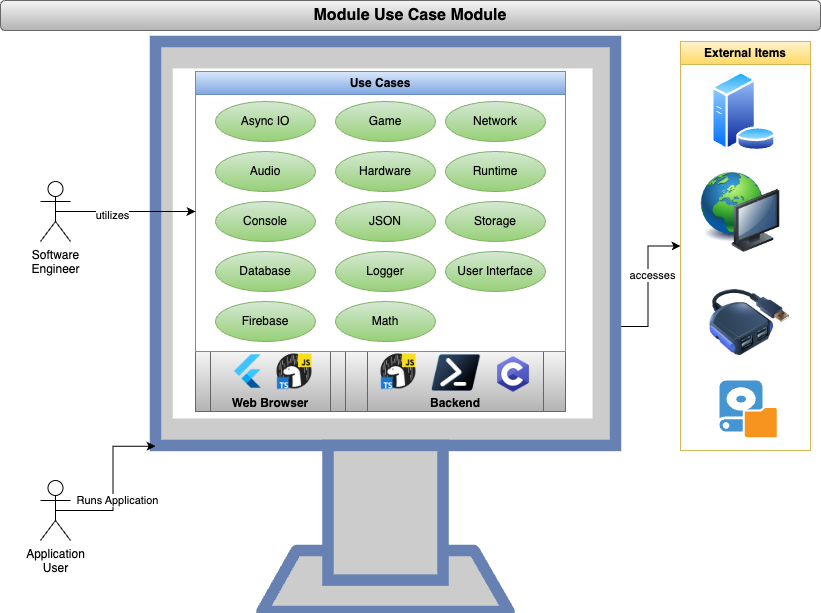

<!--
TITLE: CodeMelted Developer
PUBLISH_DATE: 2024-11-28
AUTHOR: Mark Shaffer
KEYWORDS: CodeMeltedDeveloper, raspberry-pi, modules, cross-platform, gps, html-css-javascript, flutter-apps, pwsh, js-module, flutter-library, deno-module, pwsh-scripts, pwsh-module, c-library, cpp-lib
DESCRIPTION: Software engineers are now required to learn multiple languages, technologies, and frameworks in order to fully support full stack engineering. This project aims to simplify this by developing a set of cross platform modules implementing a similar / identical Application Program Interface (API) regardless of the chosen technology covered by this project.
-->

  </a> 

<h1> CodeMelted Developer</h1>

Software engineers are now required to learn multiple languages, technologies, and frameworks in order to fully support full stack engineering. This project aims to simplify this by developing a set of cross platform modules implementing a similar / identical Application Program Interface (API) regardless of the chosen technology covered by this project.

This allows a developer to maximize their productivity because regardless of the technology, they are learning a similar module API for their solution. The solutions will also be implemented in a singular library file allowing for easy integration into developer's own project.

**LAST UPDATED:** 2024-11-28

<mark>
NOTE
  
This project being actively developed. The current modules are not production ready and the use cases are in flux as the designs are fleshed out. Be advised if you are trying things out. Dates will be included so a developer is aware of the latest happening with a given module / use case.
  

</mark>

**Table of Contents**

- [FEATURES](#features)
  - [Cross Platform Modules](#cross-platform-modules)
  - [Use Cases](#use-cases)
- [Getting Started](#getting-started)
  - [Environment Setup](#environment-setup)
    - [GitHub](#github)
    - [Programming Languages](#programming-languages)
    - [VS Code](#vs-code)
  - [Module Versioning](#module-versioning)
  - [Build Script](#build-script)
- [LICENSE](#license)

## FEATURES

The use case model featured above identifies 20 common developer use cases divided into four major reasons of how to architect a software application. Each of these use cases will be implemented with a similar API across the different [Cross Platform Modules](#cross-platform-modules) technology stacks. This will allow developers to easily create solutions regardless of the target platform of a web browser, backend (desktop, server, cloud), or Internet of Things (IoT) (i.e. esp32, Raspberry Pi).

### Cross Platform Modules

The cross platform modules represent the chosen *CodeMelted Developer* technologies to facilitate developer's needs for building Progressive Web Apps (PWAs), facilitating automation and DevOps, and target Internet of Things (IoT) solutions. They will be implemented as singular file solutions to allow for easy integration into a developer's toolchain project not requiring the toolchains of this repo for maintenance.

-  [CodeMelted Web](codemelted_web/README.md): The web represents the best cross platform target for allowing your users to access your application via a Progressive Web App (PWA). This project will consist of two modules. The `codemelted.js` module will implement the use cases that wrap the Web APIs to allow for building Single Page Apps (SPAs) web pages. It will also wrap the Deno Runtime APIs to support backend support for your PWA. The secondary `codemelted.dart` module is a Flutter web targeted module that links to the `codemelted.js` for most Web API access but gives developers the power of the Flutter widget toolkit.
-  [CodeMelted Terminal](codemelted_terminal/README.md): The terminal provides access to all things requiring automation via DevOps whether on a server or a desktop PC. This project will consist of two modules providing a Command Line Interface (CLI) to the identified use cases. The first module will be a PowerShell Core (pwsh) experience bringing the power of .NET core via the pwsh terminal shell. A developer can utilize object streaming and has access to a Terminal User Interface (TUI) for more complex user interactive tasks. The second module will be a Python module integrated into the native shell for the given operating system. This will be more limited since the data type outputs will be strings but won't require the installation of another terminal shell. The Python module itself will expose the use cases to allow for building multiple Python scripts for a more complex terminal solution.
-  [CodeMelted IoT](codemelted_iot/README.md): IoT provides low level device implementation of app / services where the need for speed is critical. This project will implement C-style C++. This means the header will be purely C allowing for easy integration into other project while implementing a C++ implementation that utilizes the minimum set of the C++ Standard Template Library (STL). This gives the developer several options with this. They can build their own app / service, compile a library for integration into another language, or as Web Assembly for supporting Progressive Web Apps (PWAs).
-  [CodeMelted Pi](codemelted_pi/README.md): Raspberry Pis are single board computers that can provide all sorts of interesting solutions. This project will utilize the modules above to explore different solutions. These range from a car infotainment solution, sky watching 360 photography, and any other solutions that serve as a fun idea for the cross platform modules.

### Use Cases

The use cases represent a further exploration of the acceptance criteria and design for the cross platform modules. These documents will contain the references to design concepts and SDKs that will implement the given module. The modules themselves will reference these documents for their given implementation.

- [Async IO](use_cases/async_io.md): All programming happens synchronously (i.e. one instruction to the next). This occurs within the event loop of the main SDK execution thread. This use case will provide the ability for chunking up this work. The developer will be able to schedule one off tasks awaiting the result via a promise. They will have the ability to schedule repeating tasks. They will have the ability to communicate with other services via a process. Lastly they will have the ability to queue tasks for processing via a worker pool.
- [Data](use_cases/data.md): The number one reason developers write code is to take data in as input, process it, and then spit that data as output. Going along with this philosophy, this use case will provide a developer the ability read, write, and process data. The input / output mechanisms will be via files, embedded database, and storage facilities for holding key / value pairs of data. Given the dynamic nature of data, a series of type checks will be provided to the developer. Lastly JSON represents the most versatile data type that works between languages. The developer will have access to work with this data type with encoding / decoding capabilities between the JSON object and string formats.
- [Runtime](use_cases/runtime.md): A chosen SDK technology provides access to items specific to the runtime. This use case will expose those elements to the developer. This includes accessing data via hardware peripherals attached / available to a device and network services for communicating via the Internet. Also available will be logging / monitoring facilities to gage the health of an application. Finally will be a collection of mathematical formulas because you may need to calculate something.
- [User Interface](use_cases/user_interface.md): The biggest thing all applications have is a way of interacting with a user. This use case will expose a common way for either building a Command Line Interface (CLI) prompting the user for input or building a complex Single Page App (SPA) interface. This will allow for a consistent experience of communicating with an application user.

## Getting Started

### Environment Setup

The following are the items recommended for installation to properly make use of this repo in your development environment.

#### GitHub

- [ ] [git](https://git-scm.com/downloads)
- [ ] [GitHub Desktop](https://desktop.github.com/)

#### Programming Languages

- [ ] [C/C++](https://code.visualstudio.com/docs/languages/cpp)
- [ ] [Deno](https://deno.com/)
- [ ] [Flutter](https://flutter.dev/)
- [ ] [NodeJS](https://nodejs.org/en)
- [ ] [PowerShell Core](https://github.com/PowerShell/PowerShell)
- [ ] [Python](https://www.python.org/)

#### VS Code

**The Application:**

- [ ] [VS Code](https://code.visualstudio.com/)

**Extensions:**

- [ ] [C/C++ Extension Pack](https://marketplace.visualstudio.com/items?itemName=ms-vscode.cpptools-extension-pack)
- [ ] [Code Spell Checker](https://marketplace.visualstudio.com/items?itemName=streetsidesoftware.code-spell-checker)
- [ ] [Dart](https://marketplace.visualstudio.com/items?itemName=Dart-Code.dart-code)
- [ ] [Deno](https://marketplace.visualstudio.com/items?itemName=denoland.vscode-deno)
- [ ] [Docker](https://marketplace.visualstudio.com/items?itemName=ms-azuretools.vscode-docker)
- [ ] [ESLint](https://marketplace.visualstudio.com/items?itemName=dbaeumer.vscode-eslint)
- [ ] [Flutter](https://marketplace.visualstudio.com/items?itemName=Dart-Code.flutter)
- [ ] [Markdown All in One](https://marketplace.visualstudio.com/items?itemName=yzhang.markdown-all-in-one)
- [ ] [Markdown Preview Mermaid Support](https://marketplace.visualstudio.com/items?itemName=bierner.markdown-mermaid)
- [ ] [PowerShell](https://marketplace.visualstudio.com/items?itemName=ms-vscode.PowerShell)
- [ ] [Python](https://marketplace.visualstudio.com/items?itemName=ms-python.python)

### Module Versioning

The versioning of the module will be captured via GitHub or the modules documentation method. It will utilize semantic versioning `X.Y.Z` with the following rules for the numbering scheme this project.

- **X:** Completion of a given set of use case (i.e. Async IO, Data, Runtime, or User Interface).
- **Y:** Use case implemented, documented, tested, and ready for usage by a developer.
- **Z:** Bug fix or expansion of a use case.

### Build Script

The `build.ps1` script provides the ability to build different elements of this project. Execute the command option below from the root of the `codemelted_developer` repo to get the specified result.

- `./build.ps1 --build_all`: Runs all the commands below building a deployable `developer` folder with all the generated website material.
- `./build.ps1 --codemelted_developer`: Generates a static website for the main README.md along with the use_case/*.md files.
- `./build.ps1 --codemelted_web`: Compiles the module, runs any tests, and generates its SDK documentation.
- `./build.ps1 --codemelted_terminal`: Compiles the module, runs any tests, and generates its SDK documentation.
- `./build.ps1 --codemelted_iot`: Compiles the module, runs any tests, and generates its SDK documentation.Compiles the module, runs any tests, and generates its SDK documentation.
- `./build.ps1 --codemelted_pi`: Generates a static website of the raspberry pi `README.md` and supporting markdown files.

## LICENSE

MIT License

© 2024 Mark Shaffer

Permission is hereby granted, free of charge, to any person obtaining a copy of this software and associated documentation files (the "Software"), to deal in the Software without restriction, including without limitation the rights to use, copy, modify, merge, publish, distribute, sublicense, and/or sell copies of the Software, and to permit persons to whom the Software is furnished to do so, subject to the following conditions:

The above copyright notice and this permission notice shall be included in all copies or substantial portions of the Software.

THE SOFTWARE IS PROVIDED "AS IS", WITHOUT WARRANTY OF ANY KIND, EXPRESS OR IMPLIED, INCLUDING BUT NOT LIMITED TO THE WARRANTIES OF MERCHANTABILITY, FITNESS FOR A PARTICULAR PURPOSE AND NONINFRINGEMENT. IN NO EVENT SHALL THE AUTHORS OR COPYRIGHT HOLDERS BE LIABLE FOR ANY CLAIM, DAMAGES OR OTHER LIABILITY, WHETHER IN AN ACTION OF CONTRACT, TORT OR OTHERWISE, ARISING FROM, OUT OF OR IN CONNECTION WITH THE SOFTWARE OR THE USE OR OTHER DEALINGS IN THE SOFTWARE.
