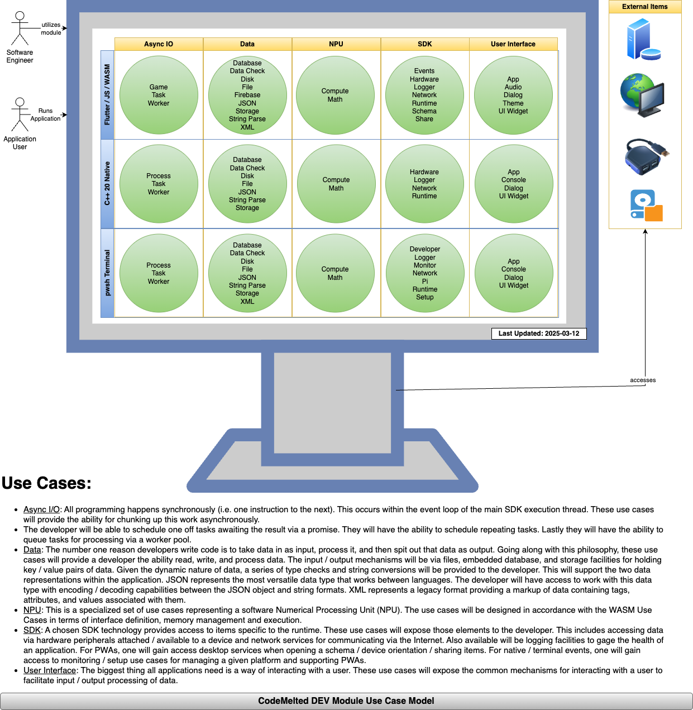

<!--
TITLE: CodeMelted DEV | Cross Platform Modules
PUBLISH_DATE: 2024-11-28
AUTHOR: Mark Shaffer
KEYWORDS: CodeMeltedDEV, raspberry-pi, modules, cross-platform, gps, html-css-javascript, flutter-apps, pwsh, js-module, flutter-library, deno-module, pwsh-scripts, pwsh-module, wasm
DESCRIPTION: Software engineers are now required to learn multiple languages, technologies, and frameworks in order to fully support full stack engineering. This project aims to simplify this by developing a set of cross platform modules implementing a similar / identical Application Program Interface (API) regardless of the chosen technology covered by this project. It gives the ability to achieve maximum application reach by supporting the development of Progressive Web Applications (PWAs). The modules are specifically designed to target each area of the technology stack to deliver PWAs.
-->

  </a> 

<h1> CodeMelted DEV | Cross Platform Modules</h1>

Software engineers are now required to learn multiple languages, technologies, and frameworks in order to fully support full stack engineering. This project aims to simplify this by developing a set of cross platform modules implementing a similar / identical Application Program Interface (API) regardless of the chosen technology covered by this project. It gives the ability to achieve maximum application reach by supporting the development of Progressive Web Applications (PWAs). The modules are specifically designed to target each area of the technology stack to deliver PWAs.

**LAST UPDATED:** 2024-12-14

**Table of Contents**

- [FEATURES](#features)
  - [Cross Platform Modules](#cross-platform-modules)
  - [Async I/O Use Cases](#async-io-use-cases)
    - [Process](#process)
    - [Task](#task)
    - [Worker](#worker)
  - [Data Use Cases](#data-use-cases)
    - [Database](#database)
    - [Disk](#disk)
    - [File](#file)
    - [JSON](#json)
    - [Storage](#storage)
  - [Runtime Use Cases](#runtime-use-cases)
    - [Logger](#logger)
    - [Hardware](#hardware)
    - [Math](#math)
    - [Network](#network)
    - [Monitor](#monitor)
  - [User Interface Use Cases](#user-interface-use-cases)
    - [Audio](#audio)
    - [Console](#console)
    - [Dialog](#dialog)
    - [SPA](#spa)
    - [Theme](#theme)
    - [Widget](#widget)
- [GETTING STARTED](#getting-started)
  - [Environment Setup](#environment-setup)
    - [GitHub](#github)
    - [Programming Languages](#programming-languages)
    - [VS Code](#vs-code)
  - [Module Versioning](#module-versioning)
  - [Build Script](#build-script)
- [LICENSE](#license)

# FEATURES

The use case model featured above identifies 19 common developer use cases divided into four major areas of how to architect a PWA. Each of these use cases will be implemented with a similar API across the different across module technology stacks. This will allow developers to easily create solutions to support their PWA.

## Cross Platform Modules

- [PWA Module](./pwa/README.md): TBD
- [Terminal Module](./terminal/README.md): TBD
- [Web Assembly Module](./wasm/README.md): TBD

## Async I/O Use Cases

All programming happens synchronously (i.e. one instruction to the next). This occurs within the event loop of the main SDK execution thread. This use case will provide the ability for chunking up this work asynchronously.

The developer will be able to schedule one off tasks awaiting the result via a promise. They will have the ability to schedule repeating tasks. They will have the ability to communicate with other services via a process. Lastly they will have the ability to queue tasks for processing via a worker pool.

### Process

<mark>TBD</mark>

### Task

<mark>TBD</mark>

### Worker

<mark>TBD</mark>

## Data Use Cases

The number one reason developers write code is to take data in as input, process it, and then spit that data as output. Going along with this philosophy, these use cases will provide a developer the ability read, write, and process data. The input / output mechanisms will be via files, embedded database, and storage facilities for holding key / value pairs of data.

Given the dynamic nature of data, a series of type checks will be provided to the developer. Lastly JSON represents the most versatile data type that works between languages. The developer will have access to work with this data type with encoding / decoding capabilities between the JSON object and string formats.

### Database

<mark>TBD</mark>

### Disk

<mark>TBD</mark>

### File

<mark>TBD</mark>

### JSON

<mark>TBD</mark>

### Storage

<mark>TBD</mark>

## Runtime Use Cases

A chosen SDK technology provides access to items specific to the runtime. This use case will expose those elements to the developer. This includes accessing data via hardware peripherals attached / available to a device and network services for communicating via the Internet. Also available will be logging / monitoring facilities to gage the health of an application. Finally will be a collection of mathematical formulas because you may need to calculate something.

### Logger

<mark>TBD</mark>

### Hardware

<mark>TBD</mark>

### Math

<mark>TBD</mark>

### Network

<mark>TBD</mark>

### Monitor

<mark>TBD</mark>

## User Interface Use Cases

The biggest thing all applications have is a way of interacting with a user. This use case will expose a common way for either building a Command Line Interface (CLI) prompting the user for input or building a complex Single Page App (SPA) interface. This will allow for a consistent experience of communicating with an application user.

### Audio

<mark>TBD</mark>

### Console

<mark>TBD</mark>

### Dialog

<mark>TBD</mark>

### SPA

<mark>TBD</mark>

### Theme

<mark>TBD</mark>

### Widget

<mark>TBD</mark>

# GETTING STARTED

## Environment Setup

The following are the items recommended for installation to properly make use of this repo in your development environment.

### GitHub

- [ ] [git](https://git-scm.com/downloads)
- [ ] [GitHub Desktop](https://desktop.github.com/)

### Programming Languages

- [ ] [C/C++](https://code.visualstudio.com/docs/languages/cpp)
- [ ] [Deno](https://deno.com/)
- [ ] [Flutter](https://flutter.dev/)
- [ ] [NodeJS](https://nodejs.org/en)
- [ ] [PowerShell Core](https://github.com/PowerShell/PowerShell)
- [ ] [Python](https://www.python.org/)

### VS Code

**The Application:**

- [ ] [VS Code](https://code.visualstudio.com/)

**Extensions:**

- [ ] [C/C++ Extension Pack](https://marketplace.visualstudio.com/items?itemName=ms-vscode.cpptools-extension-pack)
- [ ] [Code Spell Checker](https://marketplace.visualstudio.com/items?itemName=streetsidesoftware.code-spell-checker)
- [ ] [Dart](https://marketplace.visualstudio.com/items?itemName=Dart-Code.dart-code)
- [ ] [Deno](https://marketplace.visualstudio.com/items?itemName=denoland.vscode-deno)
- [ ] [Docker](https://marketplace.visualstudio.com/items?itemName=ms-azuretools.vscode-docker)
- [ ] [ESLint](https://marketplace.visualstudio.com/items?itemName=dbaeumer.vscode-eslint)
- [ ] [Flutter](https://marketplace.visualstudio.com/items?itemName=Dart-Code.flutter)
- [ ] [Markdown All in One](https://marketplace.visualstudio.com/items?itemName=yzhang.markdown-all-in-one)
- [ ] [Markdown Preview Mermaid Support](https://marketplace.visualstudio.com/items?itemName=bierner.markdown-mermaid)
- [ ] [PowerShell](https://marketplace.visualstudio.com/items?itemName=ms-vscode.PowerShell)
- [ ] [Python](https://marketplace.visualstudio.com/items?itemName=ms-python.python)

## Module Versioning

The versioning of the module will be captured via GitHub or the modules documentation method. It will utilize semantic versioning `X.Y.Z` with the following rules for the numbering scheme this project.

- **X:** Completion of a given set of use case (i.e. Async IO, Data, Runtime, or User Interface).
- **Y:** Use case implemented, documented, tested, and ready for usage by a developer.
- **Z:** Bug fix or expansion of a use case.

## Build Script

The `build.ps1 --build-all` script provides the ability to build, test, and document the `codemelted_developer` cross platform modules. The `build.ps1 --deploy` deploys the [CodeMelted DEV](https://codemelted.com/developer) website.

# LICENSE

MIT License

© 2024 Mark Shaffer

Permission is hereby granted, free of charge, to any person obtaining a copy of this software and associated documentation files (the "Software"), to deal in the Software without restriction, including without limitation the rights to use, copy, modify, merge, publish, distribute, sublicense, and/or sell copies of the Software, and to permit persons to whom the Software is furnished to do so, subject to the following conditions:

The above copyright notice and this permission notice shall be included in all copies or substantial portions of the Software.

THE SOFTWARE IS PROVIDED "AS IS", WITHOUT WARRANTY OF ANY KIND, EXPRESS OR IMPLIED, INCLUDING BUT NOT LIMITED TO THE WARRANTIES OF MERCHANTABILITY, FITNESS FOR A PARTICULAR PURPOSE AND NONINFRINGEMENT. IN NO EVENT SHALL THE AUTHORS OR COPYRIGHT HOLDERS BE LIABLE FOR ANY CLAIM, DAMAGES OR OTHER LIABILITY, WHETHER IN AN ACTION OF CONTRACT, TORT OR OTHERWISE, ARISING FROM, OUT OF OR IN CONNECTION WITH THE SOFTWARE OR THE USE OR OTHER DEALINGS IN THE SOFTWARE.
