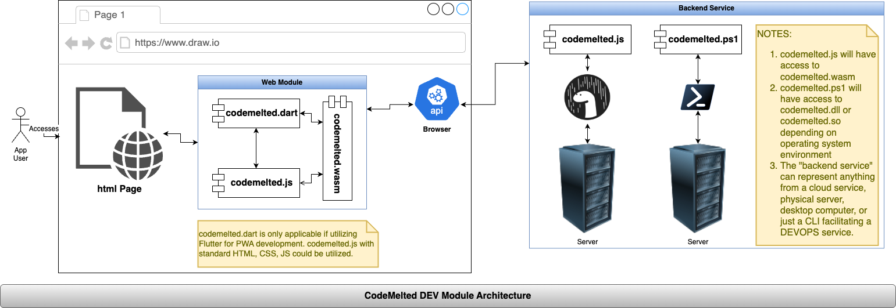

<!--
TITLE: CodeMelted DEV | pwsh Module
PUBLISH_DATE: 2025-03-12
AUTHOR: Mark Shaffer
KEYWORDS: CodeMeltedDEV, raspberry-pi, modules, cross-platform, gps, html-css-javascript, flutter-apps, pwsh, js-module, flutter-library, deno-module, pwsh-scripts, pwsh-module, c-library, cpp-lib
DESCRIPTION: The `codemelted.ps1` script will provide a Command Line Interface (CLI) to facilitate common developer use cases on Mac, Linux, or Windows systems. When installed, the CLI will provide the `codemelted` command that can be accessed in a pwsh terminal or in `ps1` scripts that facilitate a set of automated tasks. A developer may also build a Terminal User Interface (TUI) for a text based user interface. Lastly it will facilitate in developing applications utilizing the *CodeMelted DEV | Modules*.
-->
<center>
  <a title="Back To Developer Main" href="../../README.md"></a><br />
</center>
<h1> CodeMelted DEV | pwsh Module</h1>

The `codemelted.ps1` script will provide a Command Line Interface (CLI) to facilitate common developer use cases on Mac, Linux, or Windows systems. When installed, the CLI will provide the `codemelted` command that can be accessed in a pwsh terminal or in `ps1` scripts that facilitate a set of automated tasks. A developer may also build a Terminal User Interface (TUI) for a text based user interface. Lastly it will facilitate in developing applications utilizing the *CodeMelted DEV | Modules*.

**LAST UPDATED:** 2025-03-12

<center>
  <br />
  <a href="https://www.buymeacoffee.com/codemelted" target="_blank">
    
  </a>
  <br /><br />
  <p>Hope you enjoy the content. Any support is greatly appreciated. Thank you! 🙇</p>
</center>

**Table of Contents**

- [GETTING STARTED](#getting-started)
  - [Install pwsh Core](#install-pwsh-core)
    - [Mac OS](#mac-os)
    - [Linux OS](#linux-os)
    - [Windows](#windows)
    - [Raspberry Pi](#raspberry-pi)
  - [Install codemelted CLI](#install-codemelted-cli)
    - [cmdlets](#cmdlets)
    - [Troubleshooting](#troubleshooting)
      - [Linux / Mac / Raspberry Pi](#linux--mac--raspberry-pi)
      - [Windows OS](#windows-os)
- [FEATURES](#features)
  - [codemelted.ps1 Structure](#codemeltedps1-structure)
  - [codemelted --version](#codemelted---version)
  - [codemelted --help](#codemelted---help)
- [USAGE](#usage)
  - [Async I/O Use Cases](#async-io-use-cases)
    - [codemelted --process](#codemelted---process)
    - [codemelted --task](#codemelted---task)
    - [codemelted --worker](#codemelted---worker)
  - [Data Use Cases](#data-use-cases)
    - [codemelted --data-check](#codemelted---data-check)
    - [codemelted --json](#codemelted---json)
    - [codemelted --string-parse](#codemelted---string-parse)
  - [NPU Use Cases](#npu-use-cases)
  - [SDK Use Cases](#sdk-use-cases)
    - [codemelted --logger](#codemelted---logger)
    - [codemelted --network](#codemelted---network)
    - [codemelted --runtime](#codemelted---runtime)
  - [User Interface Use Cases](#user-interface-use-cases)
    - [codemelted --console](#codemelted---console)
- [MODULE INFORMATION](#module-information)
  - [License](#license)
  - [Versioning](#versioning)

# GETTING STARTED

## Install pwsh Core

The following section walk you through the installation of the pwsh terminal. Once installed you can access the terminal via the `pwsh` command.

### Mac OS

From a Mac OS terminal execute the command:

```
brew install --cask powershell
```

### Linux OS

Follow the <a target="_blank" href="https://learn.microsoft.com/en-us/powershell/scripting/install/installing-powershell-on-linux">Install Powershell on Linux</a> to properly setup the pwsh terminal for your Linux flavor.

### Windows

From a windows cmd terminal execute the command

```
winget install --id Microsoft.PowerShell --source winget
```

### Raspberry Pi

The following series of commands will setup a pwsh terminal on a Raspberry Pi picking up the necessary repo and setting up the environment. Notice the `VERSION` as the currently identified version. Change this to install the latest version.

```sh
VERSION=7.5.0
sudo dpkg --add-architecture arm64
sudo apt-get update
sudo apt-get install -y libc6:arm64 libstdc++6:arm64
sudo mkdir -p /opt/microsoft/powershell/7
sudo wget -O /tmp/powershell.tar.gz https://github.com/PowerShell/PowerShell/releases/download/v${VERSION}/powershell-$VERSION}-linux-arm64.tar.gz
sudo tar zxf /tmp/powershell.tar.gz -C /opt/microsoft/powershell/7
sudo chmod +x /opt/microsoft/powershell/7/pwsh
sudo ln -s /opt/microsoft/powershell/7/pwsh /usr/bin/pwsh
sudo rm /tmp/powershell.tar.gz
pwsh --version
```

## Install codemelted CLI

The `codemelted.ps1` CLI script is hosted at [PowerShell Gallery](https://www.powershellgallery.com/packages/codemelted/0.5.3) to facilitate its installation as discussed below.

### cmdlets

- `Find-Script -Name codemelted`: To find the current version published in the PSGallery.
- `Install-Script -Name codemelted`: To install the codemelted CLI from the PSGallery.
- `Update-Script -Name codemelted`: To update to the latest version of the codemelted CLI from the PSGallery.
- `Uninstall-Script -Name codemelted`: To completely uninstall the codemelted CLI.

### Troubleshooting

#### Linux / Mac / Raspberry Pi

On the various supported unix variant operating systems, the `$env:PSModulePath` does not include the `Scripts/` path where the `Install-Script` installs the `codemelted.ps1` script file. To fix this issue, add the following entry to the appropriate **Sources** script so when you kick off `pwsh` shell, you can access the `codemelted` command.

**Sources:** The following bullets discuss the script profile order from login to executing an interactive shell. Utilize this to determine where to put the script code below to add the pwsh scripts to the `$PATH` variable.

- [Shell Startup](https://docs.nersc.gov/environment/shell_startup/)
- [zsh Guide Section 2.2](https://zsh.sourceforge.io/Guide/zshguide02.html)

**Shell Code to Add to Appropriate Login / Startup Script:**

```sh
# set PATH so it includes user's pwsh installed scripts
if [ -d "$HOME/.local/share/powershell/Scripts" ]; then
   PATH="$HOME/.local/share/powershell/Scripts:$PATH"
fi
```

#### Windows OS

No issues when running the `Install-Script` cmdlet on Windows 10/11.


*NOTE: If the `$env:PSModulePath` is not a part of the `%PATH%`, you can correct this by adding the value of `$env:PSModulePath` to the [How to Edit Environment Variables on Windows 10 or 11](https://www.howtogeek.com/787217/how-to-edit-environment-variables-on-windows-10-or-11/)*

# FEATURES

<center></center>

The following describes how the *codemelted* CLI implements the above use cases.

## codemelted.ps1 Structure

The `codemelted.ps1` is divided into three sections. The first section is the *TERMINAL MODULE DEFINITION*. This section contains the `PSScriptInfo` that describes the script on [PowerShell  Gallery](https://www.powershellgallery.com/). It also defines the general script interface, the `--version` flag, and the `--help` system.

The next section is the *USE CASE DEFINITIONS*. This section is divided into the five use case groups reflected in the use case model above. Each of these sections contains a `function codemelted_xxx {}` definition representing each individual use case function for the given group. The function definition is divided into the `<#.SYNOPSIS #>` that defines the help section along with the `param()` which defines the interface to the function. Any violation of the function will result in a `SyntaxError: xxx` which will aid in properly using the function.

The last section is the *MAIN API DEFINITION*. This defines the mapping between the `--use-case` flag to the function call. This completes the overall `codemelted --use-case @{}` CLI signature of this module. The next sections will walk you through utilizing CLI to get help on individual use cases *(NOTE: They are also covered in this page)*.

## codemelted --version

```
Name       Version Author                      Description
----       ------- ------                      -----------
codemelted 1.0.0.0 mark.shaffer@codemelted.com   A CLI to facilitate common developer use cases on Mac / Linux / Windows OS.
```

## codemelted --help

```
NAME
    codemelted_help

SYNOPSIS
    The codemelted Command Line Interface (CLI) Terminal Module. It allows
    a developer to execute the CodeMelted DEV | Module use cases within a
    pwsh terminal shell. This allows for building CLI tools, Terminal User
    Interface (TUI) tools, or building DevOps toolchain automation.

    SYNTAX:

      codemelted [Action] [Params]

    PARAMETERS:

      [Action]
        # To Learn About the CLI use cases.
        --help : Execute 'codemelted --help @{ "action" = "--use-case" }'
                 to learn more about the CLI Actions.
        --version : Get current information about the codemelted CLI

        # Async I/O Use Cases (Completed)
        --task
        --process
        --worker

        # Data Use Cases
        --database     (TBD)
        --data-check
        --disk         (IN DEVELOPMENT. DON'T USE)
        --file         (TBD)
        --json
        --string-parse
        --storage      (TBD)
        --xml          (TBD)

        # NPU Use Cases
        --compute (TBD)
        --math    (TBD)

        # SDK Use Cases
        --developer (TBD)
        --logger
        --monitor   (TBD)
        --network   (IN DEVELOPMENT. fetch usable)
        --pi        (TBD)
        --runtime
        --setup     (TBD)

        # User Interface Use Cases
        --app     (TBD)
        --console
        --dialog  (TBD)
        --ui      (TBD)

      [Params]
        The optional set of named arguments wrapped within a [hashtable]

    RETURNS:
      Will vary depending on the called [Action].
```

# USAGE

<center></center>

The following sub-sections provides examples of each of the implemented use cases.

## Async I/O Use Cases

### codemelted --process

```

```

### codemelted --task

```
NAME
    codemelted_task

SYNOPSIS
    SYNTAX:
      # Kicks off a one off background processing task that returns a
      # promise that will eventually hold the answer. The two required
      # are the action and task. Utilize the param() within the task
      # scriptblock to receive data for the task. Make sure to return the
      # answer for the promise to contain the result.
      $answer = codemelted --task @{
        action = "run";        # required
        task = [scriptblock];  # required
        data = [object];       # optional
        delay = [int];         # optional
      }

        'task' Example:
          $task = {
            param($data)
            return $data + 5
          }

      # To sleep the processing within the given code specify the action
      # and a delay in milliseconds. The delay is required and must be >= 0.
      codemelted --task @{
        action = "sleep";  # required
        delay = [int];     # required
      }

      # Kick-off a background repeating timer that kicks of the given
      # delay interval.
      $id = codemelted --task @{
        action = "start_timer";  # required
        task = [scriptblock];    # required
        delay = [int];           # required
      }

      codemelted --task @{
        action = "stop_timer";  # required
        data = $id;             # required
      }

    RETURNS:
      [CTaskRunResult] 'run' action result that represents a promise with
        two methods. The hasCompleted() will return $true if the answer is
        ready or $false. The result() is a blocking call that will return
        the result. It is of an [object] type so any data type can be
        returned.

      [int] 'start_timer' action with a successfully created repeating
        background timer.

      [void] 'sleep' action delays processing for a specified milliseconds.
        'stop_timer' action will end a 'start_timer' action repeating task.
```

### codemelted --worker

```
NAME
    codemelted_worker

SYNOPSIS
    Sets up a background worker pool that supports queuing JSON based objects
    to process with your own custom ID system and communicate the results
    once the background worker has completed the processing. The number of
    workers for the pool are based on the number of physical processors
    available on the host system. If the queued work exceeds the number of
    available workers, it is queued up in FIFO order so as work completes,
    a worker will pick up its processing.

    NOTE 1: The scheduling of work is FIFO. The completion of work is not
      guaranteed to complete in that order. Hence a custom ID system is
      necessary.

    NOTE 2: Only one worker pool may be running. If you attempt to start
      a new pool before stopping an existing one will result in a
      SyntaxError. This is also true if you attempt to stop or post work
      to be done on a pool that is not running.

    SYNTAX:
      # Check to see if a worker pool is running
      $isRunning = codemelted --worker @{
        action = "is_running" # required
      }

      # Post message (a.k.a.) work to the pool to process. The result of the
      # worker completing the worker will be received via the 'handler'
      # setup via the Params for the 'start' action.
      #
      # data must be a [hashtable] in whatever construct you setup.
      codemelted --worker @{
        action = "post_message";           # required
        data = @{ id = "add"; data = 25; } # required
      }

      # To terminate the worker pool.
      codemelted --worker @{
        action = "terminate"; # required
      }

      # To start a worker pool for custom background work processing.
      codemelted --worker @{
        # required
        action = "start";

        # required, The common background worker logic for all queued work.
        task = [scriptblock] {
          param([hashtable] $evt)
          $id = $evt["id"]
          $data = $evt["data"]
          if ($id -eq "add") {
            return @{
              id = "add";
              data = 25 + $data
            }
          }
        };

        # required, where you will receive the completed work
        handler = [scriptblock] {
          param([hashtable] $evt)
          Write-Host $evt["data"]
        };

        # optional (how often to check queues)
        delay = 500;
      }

    RETURNS:
      [boolean] action 'is_running' $true if a pool is running,
        $false otherwise.

      [void] for all other actions.
```

## Data Use Cases

### codemelted --data-check

```
NAME
    codemelted_data_check

SYNOPSIS
    Provides basic data validation and type checking of dynamic variables
    within a powershell script.

    SYNTAX:
      # Checks that the specified 'data' [hashtable] has the specified 'key'.
      $answer = codemelted --data-check @{
        "action" = "has_property";      # required
        "data" = [hashtable];           # required
        "key" = "name of key in data";  # required
        "should_throw" = $false         # optional
      }

      # Checks that the specified 'data' variable is the expected typename
      # specified by the 'key'.
      $answer = codemelted --data-check @{
        "action" = "type";       # required
        "data" = $variable;      # required
        "key" = "typename";      # required (.NET type names)
        "should_throw" = $false  # optional
      }

      # Checks that the specified 'data' is a well formed URI object.
      $answer = codemelted --data-check @{
        "action" = "url";        # required
        "data" = "url string";   # required
        "should_throw" = $false  # optional
      }

    RETURNS:
      [boolean] $true if data check passes, $false otherwise

    THROWS:
      [string] if 'should_throw' is set to $true in the $Params.
```

### codemelted --json

```
NAME
    codemelted_json

SYNOPSIS
    Provides the facilities to create / copy JSON compliant .NET objects and
    the ability to parse / stringify that data for storage, transmission, and
    processing of the data.

    SYNTAX:
      # Create / copy data into a new [arraylist]
      $data = codemelted --json @{
        "action" = "create_array";  # required
        "data" = $arrayListData     # optional [arraylist] to copy
      }

      # Create / copy data into a new [arraylist]
      $data = codemelted --json @{
        "action" = "create_object";  # required
        "data" = $hashTableData      # optional [arraylist] to copy
      }

      # Parse a string into a [hashtable] or [arraylist] or generic datatype
      $data = codemelted --json @{
        "action" = "parse";   # required
        "data" = $stringData  # required [string] data
      }

      # Transform a [arraylist] or [hashtable] into string data
      $data = codemelted --json @{
        "action" = "stringify"; # required
        "data" = $theData       # required [arraylist] or [hashtable] data
      }

    RETURNS:
      [arraylist] for 'create_array' / 'parse' actions.
      [hashtable] for 'create_object' / 'parse' actions.
      [string] for 'stringify' action.
      $null for invalid data types that can't be translated.
```

### codemelted --string-parse

```
NAME
    codemelted_string_parse

SYNOPSIS
    Provides the facilities to translate strings into their appropriate
    data type.

    SYNTAX:
      $data = codemelted --string-parse @{
        "action" = "";  # required
        "data" = $dataString  # required
      }

    ACTIONS:
      array / boolean / double / int / object

    RETURNS:
      [System.Collections.ArrayList] for 'array' action.
      [boolean] for 'boolean' action.
      [double] for 'double' action.
      [int] for 'int' action.
      [object] for 'object' action.
      $null for string data that can't be translated.
```

## NPU Use Cases

<mark>TBD</mark>

## SDK Use Cases

### codemelted --logger

```
NAME
    codemelted_logger

SYNOPSIS
    Provides a logging facility to report log events to STDOUT color coded
    based on the type of event. Also provides for setting up a handler to
    perform other types of processing not just to STDOUT.

    SYNTAX:
      # Set up the log level for the logging facility within the module.
      # The "data" levels are 'debug' / 'info' / 'warning' / 'error' / 'off'.
      codemelted --logger @{
        "action" = "log_level";  # required
        "data" = [string]       # optional
      }

      # Set up a log handler for logged events via the logger. This will
      # be called when the logger is not configured as off. Regardless of
      # the log level, the event will be passed to the handler. The
      # CLogRecord object will include the current moduleLogLevel.
      codemelted --logger @{
        "action" = "handler";           # required
        "data" = [scriptblock] / $null  # required
      }

      # To log data to STDOUT set the "action" to 'debug' / 'info' /
      # 'warning' / 'error'. If the event meets the module log level,
      # it will report to STDOUT color coded and time stamped.
      codemelted --logger @{
        "action" = [string]  # required
        "data"   = [string]  # required
      }

    RETURNS:
      [string] When the action is 'log_level' but no log level is set.
      [void]   For all other actions.
```

### codemelted --network

```
NAME
    codemelted_network

SYNOPSIS
    Provides a basic mechanism for interacting with a user via STDIN and
    STDOUT for later processing within a script.

    SYNTAX:
      # Perform a network fetch to a REST API. The "data" is a [hashtable]
      # reflecting the named parameters of the Invoke-WebRequest. So the two
      # most common items will be "method" / "body" / "headers" but others
      # are reflected via the link.
      $resp = codemelted --network @{
        "action" = "fetch";    # required
        "url" = [string / ip]; # required
        "data" = [hashtable]   # required
      }

      # FUTURE ACTIONS not implemented yet.
      http_server / websocket_client / websocket_server

    RETURNS:
      [CNetworkResponse] for the 'fetch' action that has the statusCode,
        statusText, and data as properties. Methods of asBytes(), asObject(),
        asString() exists to get the data of the expected type or $null if
        not of that type.

RELATED LINKS
    Invoke-WebRequest Details:
    https://learn.microsoft.com/en-us/powershell/module/microsoft.powershell.utility/invoke-webrequest
```

### codemelted --runtime

```
NAME
    codemelted_runtime

SYNOPSIS
    Provides an interface for interacting and learning about the host
    operating system.

    SYNTAX:
      Lookups:
        # Provides the ability to lookup / run commands with the host
        # operating system. These actions are 'environment' / 'exist' /
        # 'system'. These would have a corresponding name identified that
        # will lookup a variable with the environment, check on a command
        # that exist, or a system command to execute (to include
        # parameters to command).
        $answer = codemelted --runtime @{
          "action" = [string] # required action identified above.
          "name" = [string]   # required
        }

      Queryable Actions:
        # Queryable answers to items available about the host operating
        # system. These actions are 'home_path' / 'hostname' / 'newline' /
        # 'online' / 'os_name' / 'os_version' / 'path_separator' /
        # 'processor_count' / 'temp_path' / 'username'
        $answer = codemelted --runtime @{
          "action" = [string] # required action identified above.
        }

      Stats:
        # Gets the current stats of the host operating system.
        # These actions are 'stats_disk' / 'stats_perf' / 'stats_tcp' /
        # 'stats_udp'
        $answer = codemelted --runtime @{
          "action" = [string] # required action identified above.
        }

    RETURNS:
      Lookups:
        [bool] $true if a 'command' action exists.
        [string] For a environment variable found or $null if not. For a
          'system' action, this will be the STDOUT of the command.

      Queryable Actions:
        [bool] for the 'online' queryable action. $true means path to Internet.
          $False means no path to the Internet.
        [char] for the 'newline' queryable action.
        [int] for the 'processor_count' queryable action.
        [string] for all the queryable actions.

      Stats:
        # 'stats_disk' action:
        [hashtable] @{
          "bytes_used_percent" = [double];
          "bytes_used" = [int]; # kilobytes
          "bytes_free" = [int]; # kilobytes
          "bytes_total" = [int]; # kilobytes
        }

        # 'stats_perf' action:
        [hashtable] @{
          "cpu_used_percent" = [double];
          "cpu_processor_count" = [int];
          "mem_used_percent" = [double];
          "mem_used_kb" = [int];
          "mem_available_kb" = [int];
          "mem_total_kb" = [int];
      }

      [string] for 'stats_tcp' / 'stats_udp' action.
```

## User Interface Use Cases

### codemelted --console

```
NAME
    codemelted_console

SYNOPSIS
    Provides a basic mechanism for interacting with a user via STDIN and
    STDOUT for later processing within a script.

    SYNTAX:
      $answer = codemelted --console @{
        "action" = "";  # required
        "message" = ""; # optional message to associate with action
        "choices" = @(  # required when using the 'choose' action.
          "dog",
          "cat",
          "fish"
        )
      }

    ACTIONS:
      alert / confirm / choose / password / prompt / writeln

    RETURNS:
      alert    [void]
      confirm  [boolean]
      choose   [int]
      password [string]
      prompt   [string]
      writeln  [void]
```

# MODULE INFORMATION

The following sub-sections cover various aspects the `codemelted.ps1` module information. It is a single file implementation of the identified use cases.

## License

MIT License

© 2024 Mark Shaffer

Permission is hereby granted, free of charge, to any person obtaining a copy of this software and associated documentation files (the "Software"), to deal in the Software without restriction, including without limitation the rights to use, copy, modify, merge, publish, distribute, sublicense, and/or sell copies of the Software, and to permit persons to whom the Software is furnished to do so, subject to the following conditions:

The above copyright notice and this permission notice shall be included in all copies or substantial portions of the Software.

THE SOFTWARE IS PROVIDED "AS IS", WITHOUT WARRANTY OF ANY KIND, EXPRESS OR IMPLIED, INCLUDING BUT NOT LIMITED TO THE WARRANTIES OF MERCHANTABILITY, FITNESS FOR A PARTICULAR PURPOSE AND NONINFRINGEMENT. IN NO EVENT SHALL THE AUTHORS OR COPYRIGHT HOLDERS BE LIABLE FOR ANY CLAIM, DAMAGES OR OTHER LIABILITY, WHETHER IN AN ACTION OF CONTRACT, TORT OR OTHERWISE, ARISING FROM, OUT OF OR IN CONNECTION WITH THE SOFTWARE OR THE USE OR OTHER DEALINGS IN THE SOFTWARE.

## Versioning

The versioning of the module will be captured via GitHub or the modules documentation method. It will utilize semantic versioning `X.Y.Z` with the following rules for the numbering scheme this project.

- **X:** Completion of a given set of use cases (i.e. Async IO, Data, NPU, SDK, or User Interface).
- **Y:** Use case implemented, documented, tested, and ready for usage by a developer.
- **Z:** Bug fix or expansion of a use case.
