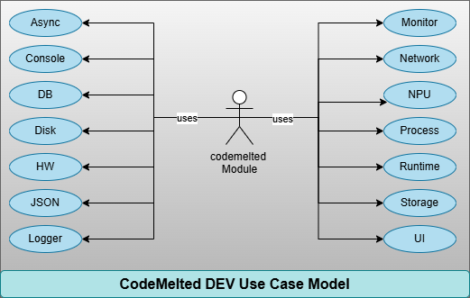
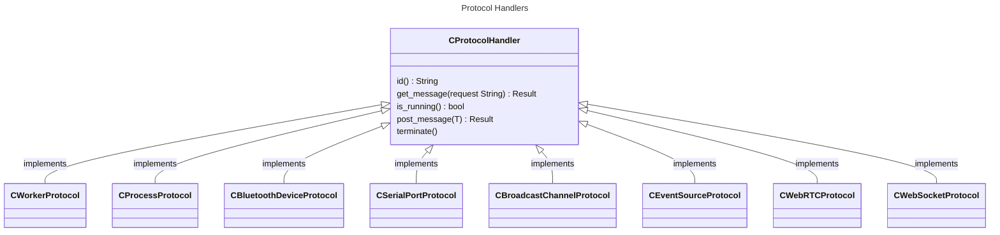

# 1.0 Functional Decomposition

<center></center>

## 1.1 Use Case Breakdown

1. **Async:** Asynchronous processing both on a main thread, via background threads, repeating timers, and dedicated workers provide a software engineer the ability to schedule work in a way to run more then one task efficiently.
2. **Console:** Provides a set of STDIN / STDOUT functionality to build an interactive terminal application without a dedicated UI.
3. **DB:** Provides the mechanism for building out an embedded database solution specific to the chosen SDK environment for the language to store complex data structures.
4. **Disk:** Provides the functionality to work with and manage files on a hard disk.
5. **HW:** Provides the mechanisms to interact with hardware peripherals via BLE and RS-232 Serial connected to a system.
6. **JSON:** JSON is the most common data format to work with for web technologies. This will provide all the mechanisms necessary to work with this data.
7. **Logger:** Provides a simple logging facility to log to STDOUT along with hookup a log handler for further processing in production.
8. **Monitor:** Running a dedicated application or service necessitates the ability to monitor the host operating environment. This will establish monitoring capabilities based on the SDK technology.
9. **Network:** The Internet is how apps communicate. This will provide access to web technologies to facilitate this communication.
10. **NPU:**  Stands for Numeric Processing Unit, this will be where all the math is at. Applications need to crunch numbers. This will provide that functionality.
11. **Process:** Provides the interface to interact with host operating system programs as one-off / bi-directional dedicated processes.
12. **Runtime:** Provides the ability to query common properties of the host operating system along with SDK specific hookups for the given runtime.
13. **Storage:** Provides the ability to store data in key / value pairs of strings.
14. **UI:** Identifies the items necessary for the SDK to build either a Graphical User Interface (GUI) or a Terminal User Interface (TUI) to interact with users and provide audio feedback. This establishes UI design goals but is highly tailored to the SDK.

## 1.2 Chosen SDK Languages

- <a title="Flutter Module" href="https://developer.codemelted.com/modules/flutter"></a>: The `codemelted.dart` module provides the power of Flutter to build Single Page Applications (SPA) with an easy setup to install the SPA as a Progressive Web App (PWA). This module only targets the Flutter web implementing Flutter specific code to take full advantage of the widget toolkit and Flutter native code that can be utilized within the web. The remaining use case functionality will take advantage of Flutter's bindings with the JavaScript browser APIs.
- <a title="JavaScript Module" href="https://developer.codemelted.com/modules/javascript"></a>: The `codemelted.js` module will be an ES6 module that supports its usage within Deno / NodeJS V8 runtimes for backend services along with Web browsers to support regular HTML / CSS / JS Single Page Application (SPA) development. The module will make heavy usage of JSDoc typing to ensure it works with available TypeScript type checkers within a software engineers chosen development platform. This module serves as the one that can provide a singular language for the full stack solution. The others provide enhancements where this may not be applicable.
- <a title="PowerShell Module" href="https://developer.codemelted.com/modules/powershell"></a>: The `codemelted.ps1` script will provide a Command Line Interface (CLI) to facilitate common developer use cases on Mac, Linux, or Windows systems. When installed, the CLI will provide the `codemelted` command that can be accessed in a pwsh terminal or in ps1 scripts that facilitate a set of automated tasks. A developer may also build a Terminal User Interface (TUI) for a text-based user interface. Lastly it will facilitate in developing applications utilizing the CodeMelted DEV Modules.
- <a title="Rust Crate" href="https://developer.codemelted.com/modules/rust"></a>: The `codemelted.rs` module will be an installable crate that provides the full native speed of a C/C++ application but with modern language constructs and memory safety. While C/C++ still have their place in application development, memory safety proves to be the #1 attack vector of hackers. Rust was designed to address those shortcomings and is an ideal choice to address that attack vector.

## 1.3 General Design Notes

### 1.3.1 Protocol Handlers



The above diagram reflects the basic construct for how protocols will be implemented between the different `codemelted` modules. The `error()` will hold any errors detected with the protocol signaled by either a `post_message() bool` failure or a `get_message() T` where `null` is returned or a detected error is signaled. The `is_running() bool` will reflect the active state of the protocol running and fully connected. Lastly the `terminate()` will close and cleanup any protocol forcing the creation of a new protocol object. These objects will open / connect upon creation via a module function.

### 1.3.2 Module Organization

Each `codemelted` module will be singular source files divided up into sections as follows:

```
// ==================================================
// [ID] =============================================
// ==================================================
```

These `ID'd` sections will first be common data structures utilized throughout the module. The remaining sections will be the use case implementations. The use case implementations will first contain their data structures followed by their private function helpers, and finally their public module functions.

Function names will identify the use case followed by the action being taken. So for instance `logger_log()` is the logger use case logging function. Finally the naming conventions of these functions will follow the naming conventions of the given SDK language. For the purposes of this document, `snake_case` will be used for diagrams and examples.

### 1.3.3 Module Versioning

The versioning of each `codemelted` module will be captured via the languages SDK versioning method. It will utilize a modified semantic versioning `X.Y.Z` with the following rules for the numbering scheme for the module.

- **X:** Year of release. Each new year resets the `Y.Z` values to `1`
- **Y:** Breaking change to one of the use case functions or upgrade of dependencies requiring considerations within an app. A change in this value resets `.Z` to `1`.
- **Z:** Bug fix, new use case function implemented, or expansion of a use case function. Continuously updated by adding one with each new release unless reset by `X.Y` changes.

### 1.3.4 Error Handling

Failed use case functions will result in an indication of failure whether a null return, boolean indicator, or a result object of sorts indicating the failure. Any violation of the module function API will result in either a `thrown` exception (in the case of Flutter, JavaScript, and PowerShell) indicating what was violated or a `panic!` when it comes to rust.
