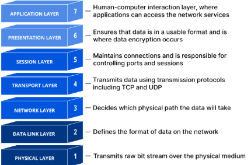

# 10.0 Network Use Case

According to Cloudflare,

> "the open systems interconnection (OSI) model is a conceptual model created by the International Organization for Standardization which enables diverse communication systems to communicate using standard protocols. In plain English, the OSI provides a standard for different computer systems to be able to communicate with each other. The OSI Model can be seen as a universal language for computer networking. It is based on the concept of splitting up a communication system into seven abstract layers, each one stacked upon the last.

  

The *Network Use Case* will facilitate several protocols that fit this model. For the Flutter and JavaScript modules, these will be client-side network protocols to communicate with servers or amongst other web apps. For PowerShell and Rust, it will be to support the server side protocols for the client-side network protocols to connect.

## 10.1 Acceptance Criteria

1. All. The *Network Use Case* will support the ability to fetch data from RESTful APIs. The response will include http status code, status text, and the particular data received with the ability to translate between it.
2. Flutter / JS Only. The *Network Use Case* will support the ability to broadcast messages between web apps and services.
3. Flutter / JS (Web) Only. The Network Use Case will support the client network protocols of Server Sent Events, Web Sockets, and WebRTC.
4. JS (Deno) / PowerShell / Rust Only. The *Network Use Case* will support the ability to act as a server for the network protocols of HTTP and Web Sockets and Web RTC.

## 10.2 SDK Notes

None.
