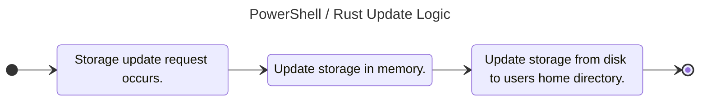

# 14.0 Storage Use Case

The *Storage Use Case* will provide a mechanism similar to the *Web Storage API*. This is a simple string key / value pair storage mechanism. Developers will have the ability to set, get, and remove items from storage. They will also have the ability to clear the entire mechanism. For the Flutter and JavaScript web runtimes, a developer will have the option to not only utilize local (long term storage) but session and cookies as storage mechanisms. For the PowerShell and Rust SDKs, the storage mechanism will mirror that of local storage and facilitate setting these values in memory while saving the storage as a file in the user's HOME directory.

## 14.1 Acceptance Criteria

1. The *Storage Use Case* will provide the ability to set a key / value string within storage.
2. The *Storage Use Case* will provide the ability to get a value based on the key from storage. If the key does not exist, then NULL is returned.
3. The *Storage Use Case* will provide the ability to remove a key / value from storage.
4. The *Storage Use Case* will provide the ability to clear all entries from storage.
5. The *Storage Use Case* will provide the ability to identify how many items exist within the storage.

## 14.2 SDK Notes

*NOTE: The above demonstrates how PowerShell / Rust will match the Web Storage API.*
