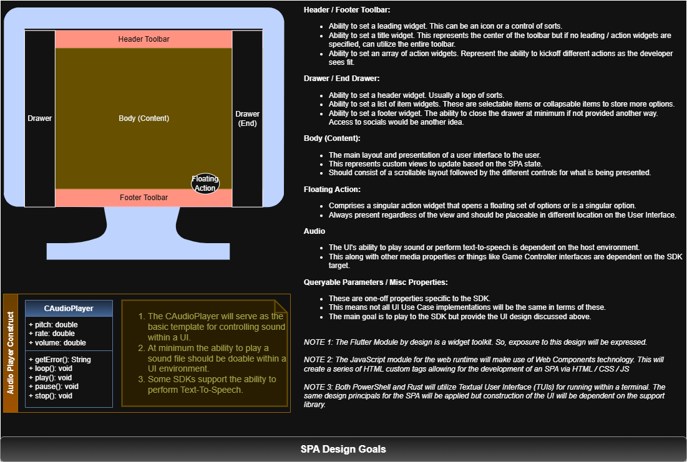

# 15.0 UI Use Case

The *UI Use Case* is all about bringing a user interface to interact and present data. The modules will strive to deliver a Single Page App (SPA) view regardless of the technology. This will treat the user interface as a divided grid as shown below. The remaining items the *UI Use Case* will provide support the SPA and its transitions.

A dialog feature will provide the ability to alert (a.k.a. snackbar), close, confirm, choose, custom, load, open, and prompt, to get information from a user. This will be asynchronous by nature. The theme feature will aim to give a theme for the overall SPA with the ability to override for an individual widget. The widgets feature will allow for building the different controls and layouts for the SPA. Lastly an audio feature will provide the ability to play sounds and perform text to speech if available for the SDK language.

**SDK Notes**

