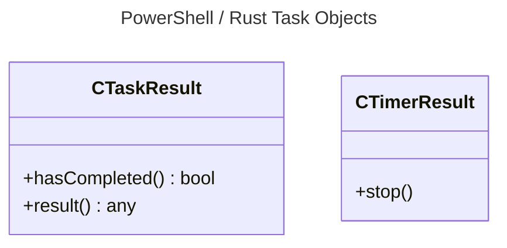

# 2.0 Async Use Case

According to Wikipedia

> a thread of execution is the smallest sequence of programmed instructions that can be managed independently by a scheduler, which is typically a part of the operating system. In many cases, a thread is a component of a process.

What this is stating is that two sets of synchronous execution can occur in parallel. This can be accomplished in two forms with many programming languages, a supported thread constructs for the given language or communicating with other operating system processes (typically another program / service).

According to MDN,

> Asynchronous software design expands upon the concept by building code that allows a program to ask that a task be performed alongside the original task (or tasks), without stopping to wait for the task to complete. When the secondary task is completed, the original task is notified using an agreed-upon mechanism so that it knows the work is done, and that the result, if any, is available.

This basically means the ability to not run code in parallel but instead time slice a main thread to run different tasks where the notification on one task completing kicks off another work task. The *Async Use Case* will implement both concepts playing to the overall strengths of each programming language SDK.

## 2.1 Acceptance Criteria

1. The *Async Use Case* will support the ability to sleep a given task in milliseconds.
2. The *Async Use Case* will support the scheduling of a task that can take data (if required) and run to completion returning a result (if required).
3. The *Async Use Case* will support the starting of a timer that repeats a specified task on a regular interval until stopped.
4. The *Async Use Case* will support the ability to start a background worker that has the ability to queue up work tasks in a first in first out (FIFO) order and receive the results of the completed tasks. The returned object will be a Protocol Handler object.

## 2.2 SDK Notes

- For Flutter / JavaScript tasks on the same thread via Promises.
- For PowerShell and Rust, this is in a background thread.
- The background worker will be a dedicated thread for all SDKs.
