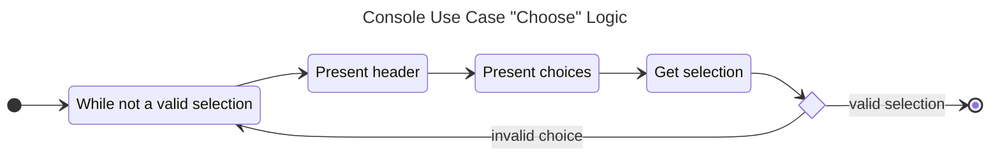

# 3.0 Console Use Case

The console as described by Microsoft,

> is an operating system window where users interact with the operating system or with a text-based console application by entering text input through the computer keyboard, and by reading text output from the computer terminal.

Mainly it represents a user interacting with a console application via a terminal shell. Once executing the console-based application, the user will be prompted / informed via STDOUT and enter data via keyboard STDIN. Closure of the console application is either via prompt or a `<ctrl> c` keystroke.

*NOTE: In this context, the console application is an interactive application via STDIN / STDOUT. It is not a dedicated Textual User Interface (TUI) or a shell command where the interaction while still via the terminal shell, is kicked off with arguments passed, and completes its work bringing the user back to the shell prompt.*

## 3.1 Acceptance Criteria

1. The *Console Use Case* will support an "Alert" feature that writes a custom message to STDOUT and waits for a user to press the "ENTER" via STDIN before continuing.
2. The *Console Use Case* will support a "Confirm" feature that writes a custom message to STDOUT and wait for a user to answer a `[y/N]` prompt via STDIN before continuing. The return will be a Boolean true for any truthy confirmation.
3. The Console Use Case will support a "Choose" feature that presents an array of choices to STDOUT and waits for a user to select that choice via STDIN before continuing. The return will be an int representing the selected index. Invalid selections will re-prompt the choices for selection until a valid choice is made.
4. The *Console Use Case* will support a "Password" feature that writes a custom message to STDOUT and waits for a user to enter their password via STDIN reflecting none of the typed characters. The return will be a String of the entered password.
5. The *Console Use Case* will support a "Prompt" feature that writes a custom message to STDOUT and waits for a user to enter prompt via STDIN reflecting the typed characters. The return will be a String of the entered prompt.
6. The *Console Use Case* will support a "Write" feature that will write data to STDOUT without a newline character. Every call to this will continue to write data to STDOUT on the same line.
7. The *Console Use Case* will support a "WriteLn" feature that will write data to STDOUT with a newline character.

## 3.2 SDK Notes

