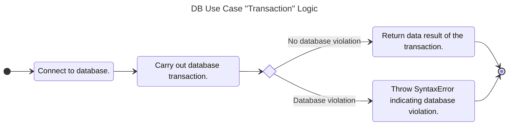

# 4.0 DB Use Case

According to Wikipedia,

> In computing, a database is an organized collection of data or a type of data store based on the use of a database management system (DBMS), the software that interacts with end users, applications, and the database itself to capture and analyze the data. The DBMS additionally encompasses the core facilities provided to administer the database. The sum total of the database, the DBMS and the associated applications can be referred to as a database system. Often the term "database" is also used loosely to refer to any of the DBMS, the database system or an application associated with the database.

For this particular use case, the organized collection will be segmented into two types of databases. A relational embedded database via SQLite for PowerShell and Rust. An indexed database (i.e. no SQL) via the Web Browser APIs. For the Deno runtime portion of JavaScript, the Deno Key Value (KV) backed by SQLite is utilized. The basic use case interface will be divided into three transaction types, manage, query, and update. These functions will be tailored to the database specifics.

## 4.1 Acceptance Criteria

1. The *DB Use Case* will support a manage feature to allow for altering the structure of the database. A true / false will be returned to indicate success or failure.
2. The *DB Use Case* will support a query feature to allow for getting data from the database. The data will be held in an array like structure tailored for the database technology.
3. The *DB Use Case* will support an update feature to allow for adding / updating / deleting data within the database. An integer will be returned indicating how many records within the database were updated.
4. Any failure of the transactions above will result in a thrown `SyntaxError` error as it will be a violation of database rules.

## 4.2 SDK Notes

*Local DB Instances*

- *Flutter / JavaScript (Web):* Will utilize IndexDB NoSQL database available in web browsers.
- *JavaScript (Deno):* Will utilize DenoKV which supports local file.
- *JavaScript (NodeJS):* TBD.
- *PowerShell / Rust:* Will utilize SQLite embedded database
