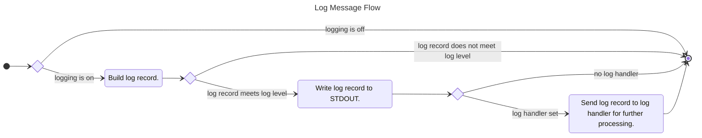

# 8.0 Logger Use Case

The most tried and true method of performing application diagnostics is logging. While Integrated Development Environments (IDEs) provide many tools to aid in development, logging captures what is happening within your application when a bug arises. And at the end of the day, bugs will always occur. To that end, the *Logger Use Case* represents a simple logging facility to STDOUT supporting four log levels.

The four log levels are DEBUG, INFO, WARNING, and ERROR. The STDOUT logging can aid while the application is being developed. Additionally, the *Logger Use Case* will provide a logged event handler that allows expanding on this logging facility to attach other processing. This can be as simple as logging to file to logging events to log server. You can decide.

## 8.1 Acceptance Criteria

1. The *Logger Use Case* will provide the ability to log to STDOUT supporting the logging levels of DEBUG, INFO, WARNING, and ERROR. The log format will be `TIMESTAMP [LEVEL]: MESSAGE`.
2. The *Logger Use Case* will support the setting of the given log level where logged events that don't meet that log level are not processed. It will also provide the ability to turn off the logging altogether.
3. The *Logger Use Case* will support the attaching of a Logged Event Handler to process logged events once they are logged to STDOUT.

## 8.2 SDK Notes

