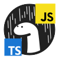

<!--
TITLE: CodeMelted - JS Module
PUBLISH_DATE: 2024-06-25
AUTHOR: Mark Shaffer
KEYWORDS: raspberry-pi, modules, cross-platform, gps, html-css-javascript, flutter-apps, pwsh, js-module, flutter-library, deno-module, pwsh-scripts, pwsh-module
DESCRIPTION: Welcome to the CodeMelted - JS Module project. This project aims to give a common fullstack solution for Progressive Web Applications (PWA) utilizing the CodeMelted - Developer use cases. It utilizes the Deno Runtime to run as your backend service. This was chosen as it has a full range of services for your backend if you choose to utilize it. You can also take your backend and host it on a different platform. This allows you to not be locked into a vendor for your backend. It was also chosen because it implements the Browser Web APIs. This allows the module to implement backend and web frontend common code developing a more complete solution. Lastly, Deno provides the use of TypeScript natively out of the box. So you are able to utilize both JavaScript / TypeScript for your solution and roll with any build system.
-->

   

<h1> CodeMelted - JS Module</h1>

Welcome to the **CodeMelted - JS Module** project. This project aims to give a common fullstack solution for Progressive Web Applications (PWA) utilizing the **CodeMelted - Developer** use cases. It utilizes the **Deno Runtime** to run as your backend service. This was chosen as it has a full range of services for your backend if you choose to utilize it. You can also take your backend and host it on a different platform. This allows you to not be locked into a vendor for your backend. It was also chosen because it implements the **Browser Web APIs**. This allows the module to implement backend and web frontend common code developing a more complete solution. Lastly, Deno provides the use of TypeScript natively out of the box. So you are able to utilize both JavaScript / TypeScript for your solution and roll with any build system.

**Table of Contents**

- [GETTING STARTED](#getting-started)
- [USAGE](#usage)
- [LICENSE](#license)

## GETTING STARTED

<mark>UNDER DEVELOPMENT</mark>

## USAGE

<mark>UNDER DEVELOPMENT</mark>

## LICENSE

MIT License

© 2024 Mark Shaffer

Permission is hereby granted, free of charge, to any person obtaining a copy of this software and associated documentation files (the "Software"), to deal in the Software without restriction, including without limitation the rights to use, copy, modify, merge, publish, distribute, sublicense, and/or sell copies of the Software, and to permit persons to whom the Software is furnished to do so, subject to the following conditions:

The above copyright notice and this permission notice shall be included in all copies or substantial portions of the Software.

THE SOFTWARE IS PROVIDED "AS IS", WITHOUT WARRANTY OF ANY KIND, EXPRESS OR IMPLIED, INCLUDING BUT NOT LIMITED TO THE WARRANTIES OF MERCHANTABILITY, FITNESS FOR A PARTICULAR PURPOSE AND NONINFRINGEMENT. IN NO EVENT SHALL THE AUTHORS OR COPYRIGHT HOLDERS BE LIABLE FOR ANY CLAIM, DAMAGES OR OTHER LIABILITY, WHETHER IN AN ACTION OF CONTRACT, TORT OR OTHERWISE, ARISING FROM, OUT OF OR IN CONNECTION WITH THE SOFTWARE OR THE USE OR OTHER DEALINGS IN THE SOFTWARE.
