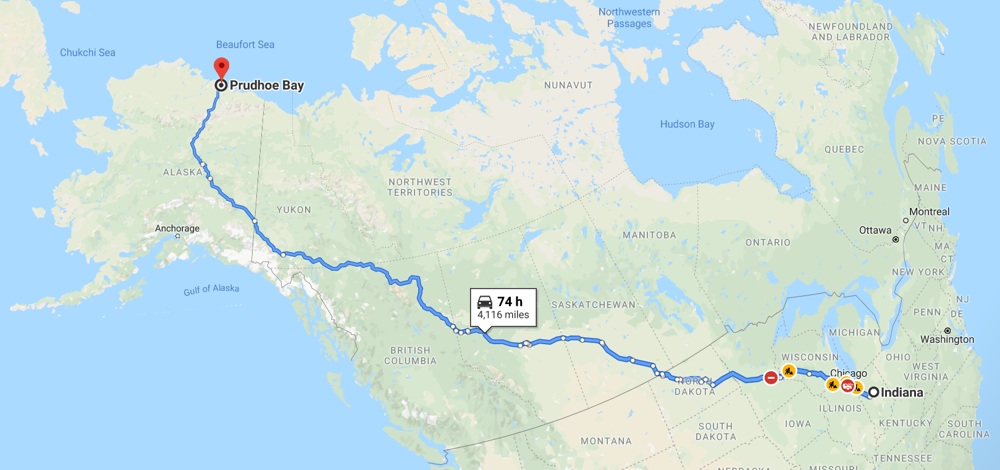

   

<h1> CodeMelted - Raspberry Pi</h1>

Welcome to the **CodeMelted - Raspberry Pi Project** project. This project aims to utilize the different **CodeMelted - Developer** modules as services on a Raspberry Pi. These services aim to allow a user to yield different configurations to utilize the Raspberry Pi. The identified services will include getting GPS coordinates, taking still frame pictures tagged with the GPS information, taking video to serve as a dash cam or web camera, provide infotainment within a vehicle, the ability to interface with the raspberry pi via the Internet, and finally, as a sky watching camera for nighttime astronomy.

**Table of Contents**

- [FEATURES](#features)
- [GETTING STARTED](#getting-started)
- [USAGE](#usage)
- [LICENSE](#license)

## FEATURES

<mark>UNDER DEVELOPMENT</mark>

## GETTING STARTED

<mark>UNDER DEVELOPMENT</mark>

## USAGE

<mark>UNDER DEVELOPMENT</mark>

## LICENSE

MIT License

© 2024 Mark Shaffer

Permission is hereby granted, free of charge, to any person obtaining a copy of this software and associated documentation files (the "Software"), to deal in the Software without restriction, including without limitation the rights to use, copy, modify, merge, publish, distribute, sublicense, and/or sell copies of the Software, and to permit persons to whom the Software is furnished to do so, subject to the following conditions:

The above copyright notice and this permission notice shall be included in all copies or substantial portions of the Software.

THE SOFTWARE IS PROVIDED "AS IS", WITHOUT WARRANTY OF ANY KIND, EXPRESS OR IMPLIED, INCLUDING BUT NOT LIMITED TO THE WARRANTIES OF MERCHANTABILITY, FITNESS FOR A PARTICULAR PURPOSE AND NONINFRINGEMENT. IN NO EVENT SHALL THE AUTHORS OR COPYRIGHT HOLDERS BE LIABLE FOR ANY CLAIM, DAMAGES OR OTHER LIABILITY, WHETHER IN AN ACTION OF CONTRACT, TORT OR OTHERWISE, ARISING FROM, OUT OF OR IN CONNECTION WITH THE SOFTWARE OR THE USE OR OTHER DEALINGS IN THE SOFTWARE.
