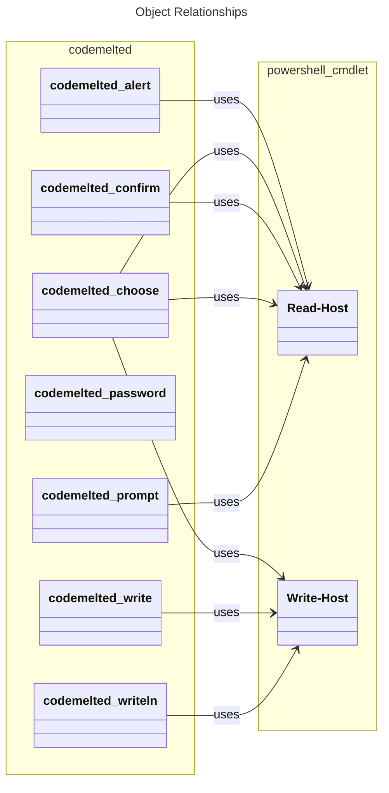

## 3.2 Console Use Case

The following is displayed when you execute `codemelted --help @{ action = "console" }`. It reflects the use case functions available further described in the sub-sections below.

```
==================================
codemelted CLI (console) Use Case
==================================

This use case provides the ability to interact with a user
via STDIN and STDOUT to provide an interactive console
experience. The use case options available are:

--console-alert
--console-confirm
--console-choose
--console-password
--console-prompt
--console-write
--console-writeln

Execute 'codemelted --help @ {action = "--uc-name"}'
for more details.
```


_NOTE: The following shows the relationship between the internally implement PowerShell functions to system available cmdlets._

### 3.2.1 --console-alert Function

```
NAME
    console_alert

SYNOPSIS
    Provides a pausing alert to STDOUT with an optional message until the user
    presses [ENTER] to continue. If no message is specified then just [ENTER]
    is presented.

    SYNTAX:
      codemelted --console-alert @{
        message = ""; # optional
      }

    RETURNS:
      [void]
```

### 3.2.2 --console-confirm Function

```
NAME
    console_confirm

SYNOPSIS
    Will prompt to STDOUT a confirmation request with optional message. The
    user will need to press [y/N] to continue with those answers turning into
    a [boolean]. If no message is specified, then "CONFIRM [y/N]" is presented
    to STDOUT.

    SYNTAX:
      $answer = codemelted --console-confirm @{
        message = "Proceed with action"; # optional
      }

    RETURNS:
      [boolean] $true if confirmed, $false otherwise.
```

### 3.2.3 --console-choose Function

```
NAME
    console_choose

SYNOPSIS
    Will present a selection menu to STDOUT based on a specified array of
    choices. Optionally you can specify a message as to what the user is
    choosing. Not specifying the message will yield a CHOOSE prompt stand in.

    SYNTAX:
      $answer = codemelted --console-choose @{
        message = "Whats the best pet"; # optional
        choices = @(  # required
          "dog",
          "cat",
          "fish"
        )
      }

    RETURNS:
      [int] based on the selected index of the choices array.
```

### 3.2.4 --console-password Function

```
NAME
    console_password

SYNOPSIS
    Writes an optional message to STDOUT to prompt for a password via STDIN.
    Not specifying a message will result in a PASSWORD stand in for the
    prompt.

    SYNTAX:
      $answer = codemelted --console-password @{
        message = ""; # optional
      }

    RETURNS:
      [string] of the entered password.
```

### 3.2.5 --console-prompt Function

```
NAME
    console_prompt

SYNOPSIS
    Writes a optional message to STDOUT to prompt for user input returned as a
    string. Not specifying the message will yield a PROMPT as the stand in
    prompt.

    SYNTAX:
      $answer = codemelted --console-prompt @{
        message = "First Name"; # optional
      }

    RETURNS:
      [string] of the entered prompt.
```

### 3.2.6 --console-write Function

```
NAME
    console_write

SYNOPSIS
    Writes a optional message to STDOUT on the same line. Not specifying a
    message is essentially a NO-OP as nothing will be written to STDOUT.

    SYNTAX:
      codemelted --console-write @{
        message = ""; # optional
      }

    RETURNS:
      [void]
```

### 3.2.7 --console-writeln Function

```
NAME
    console_writeln

SYNOPSIS
    Writes an optional message to STDOUT with a newline. Not specifying the
    message will just write a newline to STDOUT.

    SYNTAX:
      codemelted --console-writeln @{
        message = ""; # optional message to associate with action
      }

    RETURNS:
      [void]
```