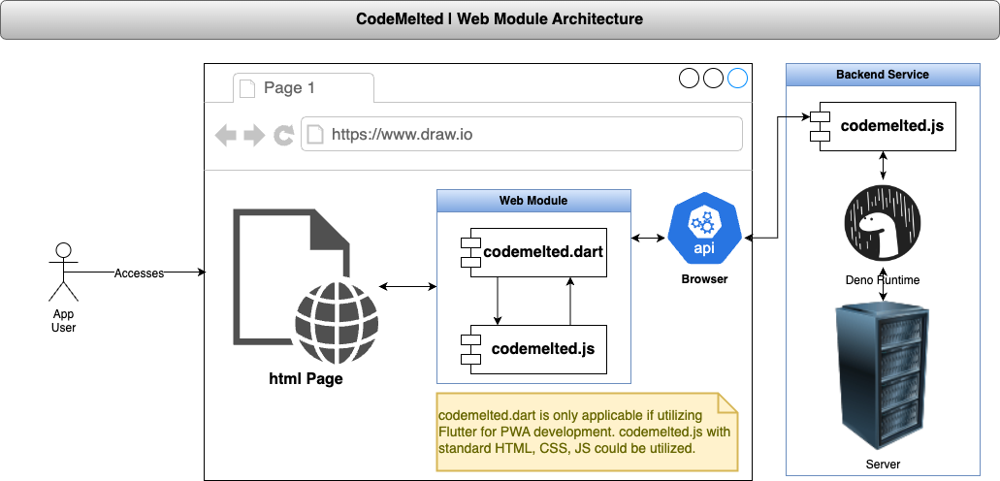

<!--
TITLE: CodeMelted Developer | Web Modules
PUBLISH_DATE: 2024-11-29
AUTHOR: Mark Shaffer
KEYWORDS: CodeMeltedDeveloper, raspberry-pi, modules, cross-platform, gps, html-css-javascript, flutter-apps, pwsh, js-module, flutter-library, deno-module, pwsh-scripts, pwsh-module, c-library, cpp-lib
DESCRIPTION: The web represents the best cross platform target for allowing your users to access your application via a Progressive Web App (PWA). This project will consist of two modules. The `codemelted.js` module will implement the use cases that wrap the Web APIs to allow for building Single Page Apps (SPAs) web pages. It will also wrap the Deno Runtime APIs to support backend support for your PWA. The secondary `codemelted.dart` module is a Flutter web targeted module that links to the `codemelted.js` for most Web API access but gives developers the power of the Flutter widget toolkit.
-->
<center>
  <a title="Back To Developer Main"  href="../README.md"></a><br />
</center>
<h1> CodeMelted Developer | Web Modules</h1>

**LAST UPDATED:** 2024-11-29

The web represents the best cross platform target for allowing your users to access your application via a Progressive Web App (PWA). This project will consist of two modules. The `codemelted.js` module will implement the use cases that wrap the Web APIs to allow for building Single Page Apps (SPAs) web pages. It will also wrap the Deno Runtime APIs to support backend support for your PWA. The secondary `codemelted.dart` module is a Flutter web targeted module that links to the `codemelted.js` for most Web API access but gives developers the power of the Flutter widget toolkit.

<center>
  
</center>

**Supporting Information:**

- [codemelted.js](js/index.html): The JavaScript SDK documenting the implementation of the *CodeMelted | Developer* use cases for the Deno and Web Browser runtimes in support of the *CodeMelted | Web Modules*.
- [Test Results](js/codemelted_test.html): The testing infrastructure and results for the *CodeMelted | Web Modules*.

## GETTING STARTED

### Flutter

Perform the following to pull the `codemelted_web` module into your project.

```yaml
dependencies:
  codemelted_flutter:
    git:
      url: https://github.com/CodeMelted/codemelted_developer.git
      ref: main
      # Or by tagged version
      # ref: codemelted_flutter_X.Y.Z
      path: codemelted_web
```

### JavaScript

<mark>UNDER DEVELOPMENT</mark>

## USAGE

The following examples represent the implementation of the **CodeMelted - Developer Cross Platform Module** identified use cases.

*NOTE: Items marked UNDER DEVELOPMENT are considered unstable. They may have implementations simple not documented as they are being developed. Use at your own risk. Items documented have been through a level of testing and are considered stable enough for usage.*

### Async IO

<mark>UNDER DEVELOPMENT</mark>

### Audio

<mark>UNDER DEVELOPMENT</mark>

### Console

<mark>UNDER DEVELOPMENT</mark>

### Database

<mark>UNDER DEVELOPMENT</mark>

### Disk

<mark>UNDER DEVELOPMENT</mark>

### Firebase

<mark>UNDER DEVELOPMENT</mark>

### Game

<mark>UNDER DEVELOPMENT</mark>

### Hardware

<mark>UNDER DEVELOPMENT</mark>

### JSON

<mark>UNDER DEVELOPMENT</mark>

### Logger

<mark>UNDER DEVELOPMENT</mark>

### Math

<mark>UNDER DEVELOPMENT</mark>

### Memory

<mark>UNDER DEVELOPMENT</mark>

### Network

<mark>UNDER DEVELOPMENT</mark>

### Runtime

<mark>UNDER DEVELOPMENT</mark>

### Storage

<mark>UNDER DEVELOPMENT</mark>

### UI

<mark>UNDER DEVELOPMENT</mark>

## CHANGE LOG

<iframe style="border: none; background-color: white;" width="100%" height="400px;" src="CHANGELOG.md"></iframe>

## LICENSE

MIT License

© 2024 Mark Shaffer

Permission is hereby granted, free of charge, to any person obtaining a copy of this software and associated documentation files (the "Software"), to deal in the Software without restriction, including without limitation the rights to use, copy, modify, merge, publish, distribute, sublicense, and/or sell copies of the Software, and to permit persons to whom the Software is furnished to do so, subject to the following conditions:

The above copyright notice and this permission notice shall be included in all copies or substantial portions of the Software.

THE SOFTWARE IS PROVIDED "AS IS", WITHOUT WARRANTY OF ANY KIND, EXPRESS OR IMPLIED, INCLUDING BUT NOT LIMITED TO THE WARRANTIES OF MERCHANTABILITY, FITNESS FOR A PARTICULAR PURPOSE AND NONINFRINGEMENT. IN NO EVENT SHALL THE AUTHORS OR COPYRIGHT HOLDERS BE LIABLE FOR ANY CLAIM, DAMAGES OR OTHER LIABILITY, WHETHER IN AN ACTION OF CONTRACT, TORT OR OTHERWISE, ARISING FROM, OUT OF OR IN CONNECTION WITH THE SOFTWARE OR THE USE OR OTHER DEALINGS IN THE SOFTWARE.
