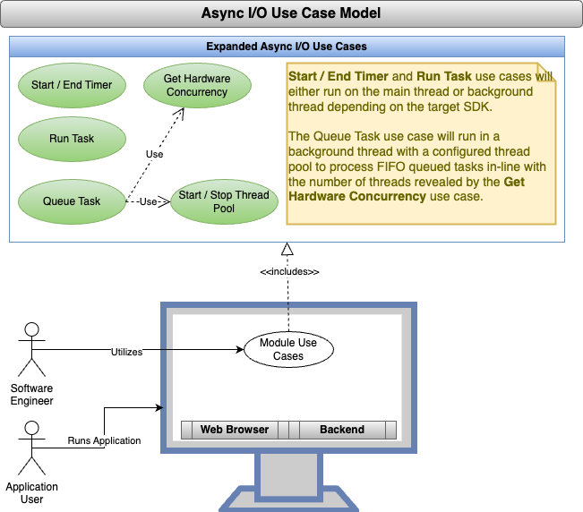
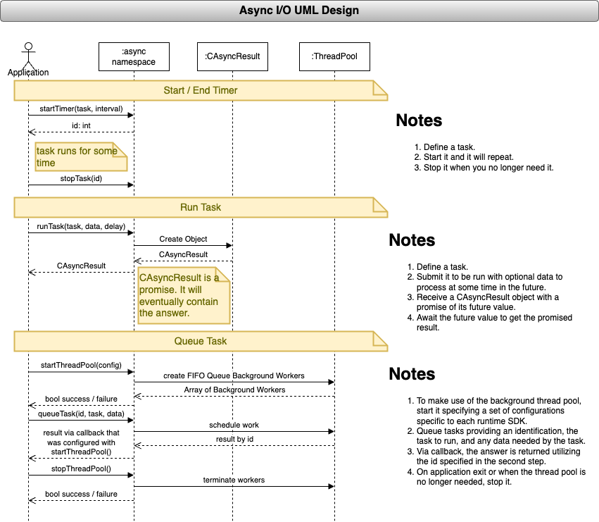

<!--
TITLE: CodeMelted - DEV | Use Case: Async IO
PUBLISH_DATE: 2024-09-12
AUTHOR: Mark Shaffer
KEYWORDS: CodeMelted - DEV, Async IO, Use Case, raspberry-pi, modules, cross-platform, gps, html-css-javascript, flutter-apps, pwsh, js-module, flutter-library, deno-module, pwsh-scripts, pwsh-module, c-library, cpp-lib
DESCRIPTION: All programming happens synchronously (i.e. one instruction to the next). This occurs within the event loop of the main SDK execution thread. This use case will provide the ability to chunk work within this main event loop along with scheduling work within a background event loop thread.
-->

   

<h1> Use Case: Async IO</h1>

All programming happens synchronously (i.e. one instruction to the next). This occurs within the event loop of the main SDK execution thread. This use case will provide the ability to chunk work within this main event loop along with scheduling work within a background event loop thread.

**Table of Contents**

- [FUNCTIONAL DECOMPOSITION](#functional-decomposition)
  - [Start / End Timer](#start--end-timer)
  - [Run Task](#run-task)
  - [Queue Task](#queue-task)
- [DESIGN NOTES](#design-notes)
- [TEST NOTES](#test-notes)
- [REFERENCES](#references)

## FUNCTIONAL DECOMPOSITION

### Start / End Timer

**Description:** An application usually has a repeating task. This task is executed on a repeating interval. It is stopped when commanded to stop. No values are returned via this task. It is simple meant to drive something on a repeating interval.

**Acceptance Criteria:**

1. The async namespace will provide the ability to start a repeating task on a specified millisecond interval.
2. The async namespace will provide the ability to stop a repeating task based on the repeating task id.

### Run Task

**Description:** An application may need to run a task that does not execute synchronously. This task will run the task and if necessary, return a value from its execution. It is a one off run task. This will either carve up the main thread's execution or run in the background depending on the runtime SDK target.

**Acceptance Criteria:**

1. The async namespace will provide the ability to run an asynchronous task with data at a specified time in the future receiving a promise to fulfill the answer.
2. The returned promise will result either in the calculated answer or a reason for failure.

### Queue Task

**Description:** A thread pool provides the ability to spin up a series of FIFO queue background workers. As you queue tasks, they are queued up in the order received. When a task is completed, it is reported back to the application with any calculated results.

**Acceptance Criteria:**

1. The async namespace will provide the ability to start a thread pool of First in First Out (FIFO) queue background workers based on the available number of CPUs.
2. The async namespace will provide the ability to queue up tasks for background processing based on a specified id and data to run with the task.
3. The async namespace will provide the calculated result via callback identifying the result via the id specified with the queued request.
4. The async namespace will provide the ability to stop the thread pool.

## DESIGN NOTES

## TEST NOTES

<mark>TBD</mark>

## REFERENCES

*NOTE: The following references reflect Flutter, JavaScript, and PowerShell research. Lower scripting environments and C will need identifying.*

Dart contributors. (2024, August 4). Asynchronous programming: futures, async, await. In *dart.dev Libraries*. Retrieved 21:00, September 12, 2024, from https://dart.dev/libraries/async/async-await

MDN contributors. (2024, July 24). Worker. In *Web Workers API*. Retrieved 20:51, September 13, 2024, from https://developer.mozilla.org/en-US/docs/Web/API/Worker

Microsoft Learn contributors. (n.d.). Start-ThreadJob. In *PowerShell 7.4 (LTS) Reference: ThreadJob*. Retrieved 21:01, September 12, 2024, from https://learn.microsoft.com/en-us/powershell/module/threadjob/start-threadjob?view=powershell-7.4

Wikipedia contributors. (2023, February 11). Thread pool. In *Wikipedia, The Free Encyclopedia*. Retrieved 00:24, September 12, 2024, from https://en.wikipedia.org/w/index.php?title=Thread_pool&oldid=1138829275
