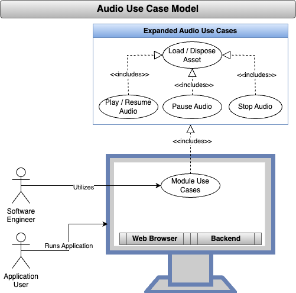
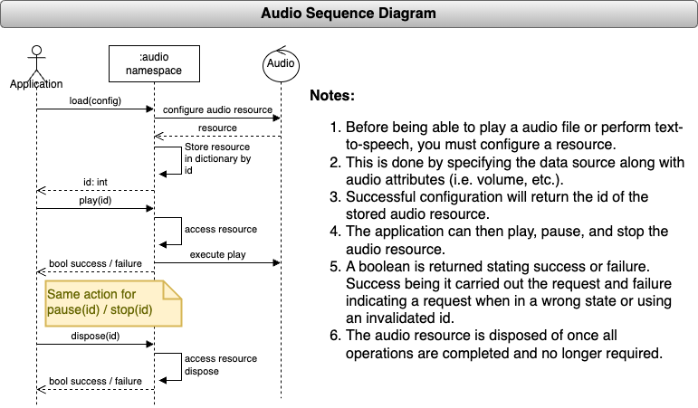

<!--
TITLE: CodeMelted - DEV | Use Case: Audio
PUBLISH_DATE: 2024-09-13
AUTHOR: Mark Shaffer
KEYWORDS: CodeMelted - DEV, Audio, Use Case, raspberry-pi, modules, cross-platform, gps, html-css-javascript, flutter-apps, pwsh, js-module, flutter-library, deno-module, pwsh-scripts, pwsh-module, c-library, cpp-lib
DESCRIPTION: Host systems provide the ability to either play audio files or translate a string into text-to-speech. This use case will expose this host processing to the developer.
-->

   

<h1> Use Case: Audio</h1>

Host systems provide the ability to either play audio files or translate a string into text-to-speech. This use case will expose this host processing to the developer.

**Table of Contents**

- [FUNCTIONAL DECOMPOSITION](#functional-decomposition)
  - [Load / Dispose Asset](#load--dispose-asset)
  - [Audio Controls](#audio-controls)
- [DESIGN NOTES](#design-notes)
- [TEST NOTES](#test-notes)
  - [Functional Demonstration](#functional-demonstration)
  - [Unit Testing](#unit-testing)
- [REFERENCES](#references)

## FUNCTIONAL DECOMPOSITION

### Load / Dispose Asset

**Description:** Each of the target SDKs offer different ways of either playing an audio file or executing text-to-speech. The [REFERENCES](#references) contains what each targeted module has as a resource. This use case identifies how an application will load the audio source along with configuration items to then carry out [Audio Controls](#audio-controls) use case. The audio resource is disposed once it is no longer required.

**Acceptance Criteria:**

1. The audio namespace will support loading a audio source with configuration parameters. The audio source is either an audio file or a string for text-to-speech. The configuration parameters are:
    - Balance
    - Pitch
    - Playback Rate
    - Volume
2. The audio namespace will support the disposal of the previously loaded audio resource.
3. The audio namespace will indicate success / failure of the loading / disposal requests.

### Audio Controls

**Description:** The audio controls use case provides the ability to play, pause, and stop execution of a loaded audio resource. These request will signal success / failure of the request.

**Acceptance Criteria:**

1. The audio namespace will allow for playing a loaded audio source.
2. The audio namespace will allow for pausing a loaded audio source.
3. The audio namespace will allow for stopping a loaded audio source.
4. The audio namespace will report success for the above request based on the following:
    - play request when not in a play state.
    - pause request when in a playing state.
    - stop request when not in a stop state.
    - A valid resource id is specified
5. The audio namespace will report failure if the conditions in acceptance criteria are not met.

## DESIGN NOTES

## TEST NOTES

### Functional Demonstration

- [ ] When an example usage is documented in the module generated documentation.
- [ ] When the module SDK details specific to each module target is documented.
- [ ] When a unit test (if applicable) specific to each module passes all tests.

### Unit Testing

- [ ] **Flutter Module:** The `test/codemelted_audio_test.dart` defines the unit tests for the Async I/O unit test implementation.
- [ ] **JavaScript Module:** Broken into the three areas:
  - `codemelted_test.ts`: Deno runtime tests with coverage.
  - `codemelted_test.html`: Mocha / Chai browser based tests executed from the PWA.
  - `codemelted_worker_test.js`: Background worker to ensure `codemelted.js` modules ability to properly load in a web worker.
- [ ] **PowerShell Module:** <mark>TBD</mark>
- [ ] **C/C++ Module:** <mark>TBD</mark>

## REFERENCES

MDN contributors. (2023, Feb 23). HTMLAudioElement. In *References Web APIs HTMLAudioElement*. Retrieved 18:51, September 13, 2024, from https://developer.mozilla.org/en-US/docs/Web/API/HTMLAudioElement

MDN contributors. (2023, Feb 23). Web Speech API. In *References Web APIs Web Speech API*. Retrieved 18:50, September 13, 2024, from https://developer.mozilla.org/en-US/docs/Web/API/Web_Speech_API

Microsoft Learn contributors. (n.d.). SoundPlayer Class. In *Learn .NET API browser System.Media*. Retrieved 18:48, September 13, 2024, from https://learn.microsoft.com/en-us/dotnet/api/system.media.soundplayer?view=net-8.0

Microsoft Learn contributors. (n.d.). SpeechSynthesizer Class. In *Learn .NET API browser System.Speech.Synthesis*. Retrieved 18:31, September 13, 2024, from https://learn.microsoft.com/en-us/dotnet/api/system.speech.synthesis.speechsynthesizer?view=net-8.0