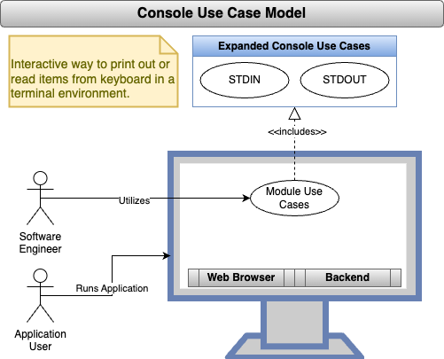

<!--
TITLE: CodeMelted - DEV | Use Case: Console
PUBLISH_DATE: 2024-10-04
AUTHOR: Mark Shaffer
KEYWORDS: CodeMelted - DEV, Console, Use Case, raspberry-pi, modules, cross-platform, gps, html-css-javascript, flutter-apps, pwsh, js-module, flutter-library, deno-module, pwsh-scripts, pwsh-module, c-library, cpp-lib
DESCRIPTION: The Console of a system supports STDIN / STDOUT / STDERR. This use case will expose these descriptors to support a developer making simple command line interface tools.
-->

   

<h1> Use Case: Console</h1>

The Console of a system supports STDIN / STDOUT / STDERR. This use case will expose these descriptors to support a developer making simple command line interface tools.

**Table of Contents**

- [FUNCTIONAL DECOMPOSITION](#functional-decomposition)
  - [STDIN](#stdin)
  - [STDOUT](#stdout)
- [DESIGN NOTES](#design-notes)
- [TEST NOTES](#test-notes)
- [REFERENCES](#references)

## FUNCTIONAL DECOMPOSITION

### STDIN

**Description:** STDIN represents the ability to setup a handle to the keyboard and receive input from it. The returned result can then be processed by an application.

**Acceptance Criteria:**

1. The console namespace will provide the ability ask for a confirmation (yes / no) choice.
2. The console namespace will provide the ability to a user to make a selection of choices.
3. The console namespace will provide the ability to obtain a user's password obscuring the user's typed response.
4. The console namespace will provide the ability to prompt for a response.

### STDOUT

**Description:** STDOUT represent the ability to reflect information to a terminal console to inform the user of things going on within a application.

**Acceptance Criteria:**

1. The console namespace will provide the ability to alert the user information requiring the user to press *Enter* to continue.
2. The console namespace will provide the ability to write a line of text to provide basic feedback to a user.

## DESIGN NOTES

- The processing of STDIN will occur with the SDK specific mechanisms for interacting with it.
- The processing of STDOUT will occur with the SDK specific mechanism for interacting with it.
- The **CodeMelted - Flutter Module** has no console mechanism within it.

## TEST NOTES

<mark>TBD</mark>

## REFERENCES

*NOTE: The following references reflect Flutter, JavaScript, and PowerShell research. Lower scripting environments and C will need identifying.*

Deno Docs contributors. (n.d.). Deno.stdin. In *Deno APIs*. Retrieved 13:33, Oct 04, 2024, from https://docs.deno.com/api/deno/~/Deno.stdin

Deno Docs contributors. (n.d.). Deno.stdout. In *Deno APIs*. Retrieved 13:35, Oct 04, 2024, from https://docs.deno.com/api/deno/~/Deno.stdout

Deno Docs contributors. (n.d.). Web Platform. In *Web APIs*. Retrieved 13:33, Oct 04, 2024, from https://docs.deno.com/api/web/platform

Microsoft Learn contributors. (n.d.). Read-Host. In *Learn PowerShell Microsoft PowerShell Utility*. Retrieved 13:29, Oct 04, 2024, from https://learn.microsoft.com/en-us/powershell/module/microsoft.powershell.utility/read-host?view=powershell-7.4

Microsoft Learn contributors. (n.d.). Write-Host. In *Learn PowerShell Microsoft PowerShell Utility*. Retrieved 13:31, Oct 04, 2024, from https://learn.microsoft.com/en-us/powershell/module/microsoft.powershell.utility/write-host?view=powershell-7.4