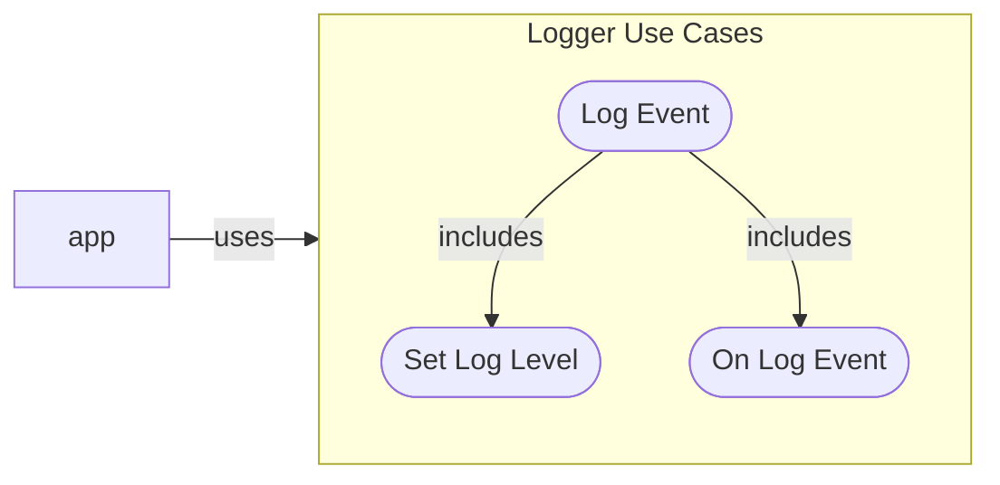
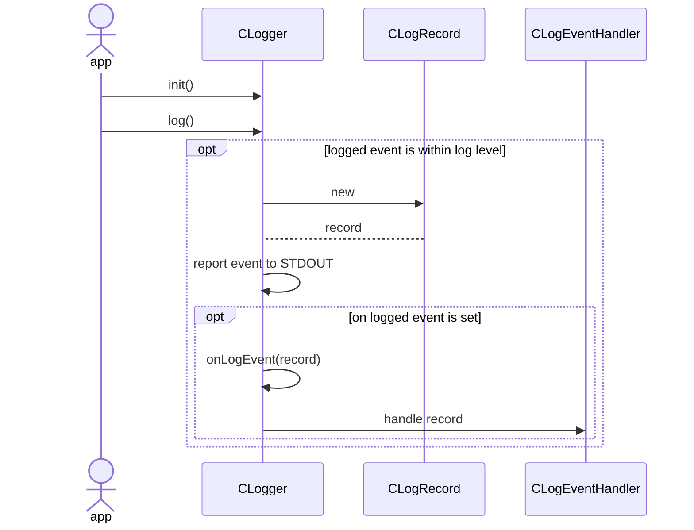

<!--
TITLE: CodeMelted - DEV | Core Use Case: Logger
PUBLISH_DATE:
AUTHOR: Mark Shaffer
KEYWORDS: CodeMelted - DEV, Logger, Core Use Case
DESCRIPTION: The codemelted modules will provide a logging facility with four levels of logging to aid in debugging and reporting of events from within an application. It will also provide post processing of logged events to allow for further processing of those events.
-->
<center>
  <a href="../../README.md"></a><br />
</center>
<h1> Core Use Case: Logger</h1>

The codemelted modules will provide a logging facility with four levels of logging to aid in debugging and reporting of events from within an application. It will also provide post processing of logged events to allow for further processing of those events.

**Table of Contents**

- [FUNCTIONAL DECOMPOSITION](#functional-decomposition)
  - [Set Log Level](#set-log-level)
  - [On Log Event](#on-log-event)
  - [Log Event](#log-event)
- [DESIGN NOTES](#design-notes)
  - [C/C++](#cc)
  - [Flutter / JavaScript](#flutter--javascript)
  - [pwsh](#pwsh)
- [TEST NOTES](#test-notes)
  - [C/C++](#cc-1)
  - [Flutter](#flutter)
  - [JavaScript](#javascript)
  - [pwsh](#pwsh-1)
- [REFERENCES](#references)
- [LICENSE](#license)

## FUNCTIONAL DECOMPOSITION



### Set Log Level

**Description:** The logger will operating with four logging levels and the ability to turn off the logging facility. This use case facilitates setting the log level to act upon within the module.

**Actors:** The application utilizing the codemelted module.

**Pre-Condition:** The logger has been properly initialized with the application.

**Post-Condition:** Log level is set for the logging facility.

**Scenario:**

1. If desired, log level is set to *debug*.
2. If desired, log level is set to *info*.
3. If desired, log level is set to *warning*.
4. If desired, log level is set to *error*.
5. If desired, log level is set to *off*.
6. END.

**Exceptions:**

None.

### On Log Event

**Description:** Standard logging will report via STDOUT to allow for quick debugging of an application and validating app reporting. Post processing of the log record allows for an app to post the log records either to a local file or a database for later analysis and troubleshooting.

**Actors:** The application utilizing the codemelted module.

**Pre-Condition:** The logger has been properly initialized with the application.

**Post-Condition:** The log record is post processed.

**Scenario:**

1. If post processing is enabled, receive the log event and process it.
2. END.

**Exceptions:**

None.

### Log Event

**Description:** A logged event will be reported via STDOUT. This will allow a developer to troubleshoot their app during development. Once their app is ready for production, post processing will be the ideal for capturing logged data along with setting an appropriate log level of events.

**Actors:** The application utilizing the codemelted module.

**Pre-Condition:** The logger has been properly initialized with the application.

**Post-Condition:**

1. The logged event is reported to STDOUT formatted as follows when a stack trace is specified:

    ```
    2024-04-25T21:17:33.816297 [SEVERE] CodeMelted-Logger: error
    #0      main.<anonymous closure>.<anonymous closure> (file:///C:/Users/DarkT/Documents/GitHub/codemelted_developer/modules/codemelted_flutter/test/codemelted_flutter_test.dart:91:46)
    #1      Declarer.test.<anonymous closure>.<anonymous closure> (package:test_api/src/backend/declarer.dart:215:19)
    <asynchronous suspension>
    #2      Declarer.test.<anonymous closure> (package:test_api/src/backend/declarer.dart:213:7)
    <asynchronous suspension>
    #3      Invoker._waitForOutstandingCallbacks.<anonymous closure> (package:test_api/src/backend/invoker.dart:258:9)
    <asynchronous suspension>
    ```
2. The logged event is reported to STDOUT formatted as follows without a stacktrace specified:

    ```
    2024-04-25T21:17:33.816297 [INFO] CodeMelted-Logger: info
    ```

3. The logged event is not reported to STDOUT due to log level setting. Meaning if the log level is set *error*, then *debug*, *info*, and *warning* events will be ignored.

**Scenario:**

1. Logger is called specifying the log level of the event, the data associated with the event, and if necessary, a stack trace.
2. [Set Log Level](#set-log-level) checks the event log level against the currently set log level to determine whether the event is reported to STDOUT.
3. [On Log Event](#on-log-event) further processes the event if it is set and the event was processed in step 2.
4. END.

**Exceptions:**

*Step 1a: Logger was not initialized.*

1. assert is thrown and developer must correct their code.
2. Proceed to step 4.

## DESIGN NOTES

### C/C++

TBD.

### Flutter / JavaScript



### pwsh

TBD.

## TEST NOTES

Identifies the testing methodology utilized to validate a module feature.

### C/C++

TBD.

### Flutter

`codemelted_flutter.dart` flutter test file covered by the `group("Logger Use Case Tests", () {}` set of tests.

### JavaScript

TBD.

### pwsh

TBD.

## REFERENCES

None.

## LICENSE

MIT License

© 2024 Mark Shaffer

Permission is hereby granted, free of charge, to any person obtaining a copy of this software and associated documentation files (the "Software"), to deal in the Software without restriction, including without limitation the rights to use, copy, modify, merge, publish, distribute, sublicense, and/or sell copies of the Software, and to permit persons to whom the Software is furnished to do so, subject to the following conditions:

The above copyright notice and this permission notice shall be included in all copies or substantial portions of the Software.

THE SOFTWARE IS PROVIDED "AS IS", WITHOUT WARRANTY OF ANY KIND, EXPRESS OR IMPLIED, INCLUDING BUT NOT LIMITED TO THE WARRANTIES OF MERCHANTABILITY, FITNESS FOR A PARTICULAR PURPOSE AND NONINFRINGEMENT. IN NO EVENT SHALL THE AUTHORS OR COPYRIGHT HOLDERS BE LIABLE FOR ANY CLAIM, DAMAGES OR OTHER LIABILITY, WHETHER IN AN ACTION OF CONTRACT, TORT OR OTHERWISE, ARISING FROM, OUT OF OR IN CONNECTION WITH THE SOFTWARE OR THE USE OR OTHER DEALINGS IN THE SOFTWARE.