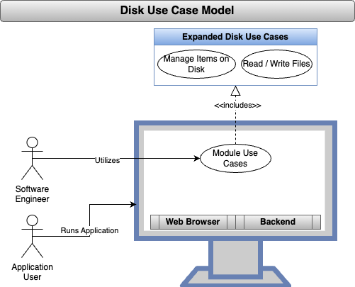

<!--
TITLE: CodeMelted - DEV | Use Case: Audio
PUBLISH_DATE: 2024-10-06
AUTHOR: Mark Shaffer
KEYWORDS: CodeMelted - DEV, Disk, Use Case, raspberry-pi, modules, cross-platform, gps, html-css-javascript, flutter-apps, pwsh, js-module, flutter-library, deno-module, pwsh-scripts, pwsh-module, c-library, cpp-lib
DESCRIPTION: Applications have access to hard disk which houses directories, files, and other information. This use case will expose the ability to manage the disk along with interface with said files from the disk.
-->
<center>
  <a title="Back To Developer Main" href="../README.md"></a><br />
</center>
<h1> Use Case: Disk</h1>

Applications have access to hard disk which houses directories, files, and other information. This use case will expose the ability to manage the disk along with interface with said files from the disk.

**Table of Contents**

- [FUNCTIONAL DECOMPOSITION](#functional-decomposition)
  - [Manage Items on Disk](#manage-items-on-disk)
  - [Read / Write Files](#read--write-files)
- [DESIGN NOTES](#design-notes)
  - [Flutter / JavaScript Modules](#flutter--javascript-modules)
  - [PowerShell Module](#powershell-module)
  - [C Module](#c-module)
- [TEST NOTES](#test-notes)
  - [Flutter Module](#flutter-module)
  - [JavaScript Module](#javascript-module)
  - [PowerShell Module](#powershell-module-1)
  - [C Module](#c-module-1)
- [REFERENCES](#references)

## FUNCTIONAL DECOMPOSITION

<center></center>

### Manage Items on Disk

**Description:** This use case is the management of files / directories on a local disk. This includes getting of listing of files, being able to copy, delete, or move those file. Along with this is the management of directories to also include copying, deleting, or moving them. Lastly is the ability to determine the temporary and user's home directory on the disk.

**Acceptance Criteria:**

1. The disk namespace will provide the ability to manage the local disk by
   - Copy files and directories
   - Creating files and directories
   - Delete files and directories
   - List files and directories
   - Move files and directories
2. The disk namespace will provide the ability to query the local disk for
   - Information about an item on disk to include if it is a file, a directory, a symbolic link, its size, and its permissions
   - Path separator for directories
   - Platform's temporary directory
   - User's home directory

### Read / Write Files

**Description:** Besides managing files, a user will want to read and write data from a file. This use case will provide the ability to work with files in an array of configurations based on the targeted SDK environment.

**Acceptance Criteria:**

1. The disk namespace will provide the ability to read / write (append / new) an entire file as
   - As bytes
   - As a string
2. When possible the disk namespace will provide the ability to read / write file chunks as
   - Seeking bytes within a file
   - Line by line for string files
3. When possible the disk namespace will provide a file chooser dialog to
   - Specify a file / directory to open
   - Specify a file to save

## DESIGN NOTES

### Flutter / JavaScript Modules

The call signature into the namespace will be as follows:

```javascript
codemelted.disk.functionName();
```

### PowerShell Module

<mark>TBD</mark>

### C Module

<mark>TBD</mark>


## TEST NOTES

### Flutter Module

<mark>TBD</mark>

### JavaScript Module

- The `codemelted.disk.readEntireFile()` and `codemelted.disk.writeEntireFile()` was validated via browser functional testing.
- The `codemelted_test.html` confirms that a `SyntaxError` is thrown with each attempt to utilize one of the `codemelted.disk.*` functions in an unsupported target runtime.
- The `codemelted_test.ts` deno test environment exercises each of the `codemelted.disk.*` functions ensuring they work as expected.

### PowerShell Module

<mark>TBD</mark>

### C Module

<mark>TBD</mark>

## REFERENCES

Deno Docs contributors. (n.d.). Deno File System. In *Deno APIs*. Retrieved 22:52, Oct 06, 2024, from https://docs.deno.com/api/deno/file-system
