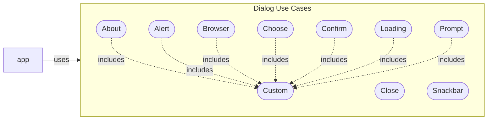

<!--
TITLE: CodeMelted - DEV | UI Use Case: Dialog
PUBLISH_DATE: 2024-04-30
AUTHOR: Mark Shaffer
KEYWORDS: CodeMelted - DEV, Dialog, UI Use Case
DESCRIPTION: The ability to present information to a user is a staple of modern user interface development. The use cases expanded upon will provide several one-off informing dialogs to a user for quick interaction. It will also provide the ability to setup custom dialogs for more complex information. The dialogs will be asynchronous in nature allowing for chunking up the main UI thread of the chosen module SDK.
-->

   

<h1> UI Use Case: Dialog</h1>

The ability to present information to a user is a staple of modern user interface development. The use cases expanded upon will provide several one-off informing dialogs to a user for quick interaction. It will also provide the ability to setup custom dialogs for more complex information. The dialogs will be asynchronous in nature allowing for chunking up the main UI thread of the chosen module SDK.

**Table of Contents**

- [FUNCTIONAL DECOMPOSITION](#functional-decomposition)
  - [About](#about)
  - [Alert](#alert)
  - [Browser](#browser)
  - [Choose](#choose)
  - [Close](#close)
  - [Confirm](#confirm)
  - [Custom](#custom)
  - [Loading](#loading)
  - [Prompt](#prompt)
  - [Snackbar](#snackbar)
- [DESIGN NOTES](#design-notes)
- [TEST NOTES](#test-notes)
- [REFERENCES](#references)

## FUNCTIONAL DECOMPOSITION

### About

**Description:** Applications tend to want to identify themselves. Also important is giving credit to 3rd party APIs that may be utilized within your application.

**Actors:** The application utilizing the codemelted module.

**Pre-Condition:** Information to display on dialog is gathered. This information includes icon, name, version, and legalese. All the information is optional.

**Post-Condition:** Dialog is displayed with app information until user dismisses it.

**Scenario:** None.

**Exceptions:** None.

### Alert

**Description:** Applications will need to alert a user to things happening. This usually occurs via an alert of stating what is happening.

**Actors:** The application utilizing the codemelted module.

**Pre-Condition:** App has something to display to the user specifying a custom title and a message.

**Post-Condition:** Dialog is displayed with custom message and title if specified. If title is not specified, then *Attention* is displayed.

**Scenario:** None.

**Exceptions:** None.

### Browser

**Description:** [GENERAL DESCRIPTION OF WHAT THIS USE CASE IS ABOUT]

**Actors:** The application utilizing the codemelted module.

**Pre-Condition:** [WHAT MUST BE TRUE BEFORE THE CASE CASE RUNS]

**Post-Condition:** [WHAT MUST BE TRUE AFTER THE CASE CASE RUNS]

**Scenario:** None.

**Exceptions:** None.

### Choose

**Description:** [GENERAL DESCRIPTION OF WHAT THIS USE CASE IS ABOUT]

**Actors:** The application utilizing the codemelted module.

**Pre-Condition:** [WHAT MUST BE TRUE BEFORE THE CASE CASE RUNS]

**Post-Condition:** [WHAT MUST BE TRUE AFTER THE CASE CASE RUNS]

**Scenario:** None.

**Exceptions:** None.

### Close

**Description:** [GENERAL DESCRIPTION OF WHAT THIS USE CASE IS ABOUT]

**Actors:** The application utilizing the codemelted module.

**Pre-Condition:** [WHAT MUST BE TRUE BEFORE THE CASE CASE RUNS]

**Post-Condition:** [WHAT MUST BE TRUE AFTER THE CASE CASE RUNS]

**Scenario:** None.

**Exceptions:** None.

### Confirm

**Description:** [GENERAL DESCRIPTION OF WHAT THIS USE CASE IS ABOUT]

**Actors:** The application utilizing the codemelted module.

**Pre-Condition:** [WHAT MUST BE TRUE BEFORE THE CASE CASE RUNS]

**Post-Condition:** [WHAT MUST BE TRUE AFTER THE CASE CASE RUNS]

**Scenario:** None.

**Exceptions:** None.

### Custom

**Description:** [GENERAL DESCRIPTION OF WHAT THIS USE CASE IS ABOUT]

**Actors:** The application utilizing the codemelted module.

**Pre-Condition:** [WHAT MUST BE TRUE BEFORE THE CASE CASE RUNS]

**Post-Condition:** [WHAT MUST BE TRUE AFTER THE CASE CASE RUNS]

**Scenario:** None.

**Exceptions:** None.

### Loading

**Description:** [GENERAL DESCRIPTION OF WHAT THIS USE CASE IS ABOUT]

**Actors:** The application utilizing the codemelted module.

**Pre-Condition:** [WHAT MUST BE TRUE BEFORE THE CASE CASE RUNS]

**Post-Condition:** [WHAT MUST BE TRUE AFTER THE CASE CASE RUNS]

**Scenario:** None.

**Exceptions:** None.

### Prompt

**Description:** [GENERAL DESCRIPTION OF WHAT THIS USE CASE IS ABOUT]

**Actors:** The application utilizing the codemelted module.

**Pre-Condition:** [WHAT MUST BE TRUE BEFORE THE CASE CASE RUNS]

**Post-Condition:** [WHAT MUST BE TRUE AFTER THE CASE CASE RUNS]

**Scenario:** None.

**Exceptions:** None.

### Snackbar

**Description:** [GENERAL DESCRIPTION OF WHAT THIS USE CASE IS ABOUT]

**Actors:** The application utilizing the codemelted module.

**Pre-Condition:** [WHAT MUST BE TRUE BEFORE THE CASE CASE RUNS]

**Post-Condition:** [WHAT MUST BE TRUE AFTER THE CASE CASE RUNS]

**Scenario:** None.

**Exceptions:** None.

## DESIGN NOTES

[UML, API EXAMPLES, etc.]

## TEST NOTES

[FORMAL TESTS TO RUN, NEW TEST NOTES, CONFIGURATIONS, etc.]

## REFERENCES

[ANY OUTSIDE ARTIFACTS RELATED TO THIS]